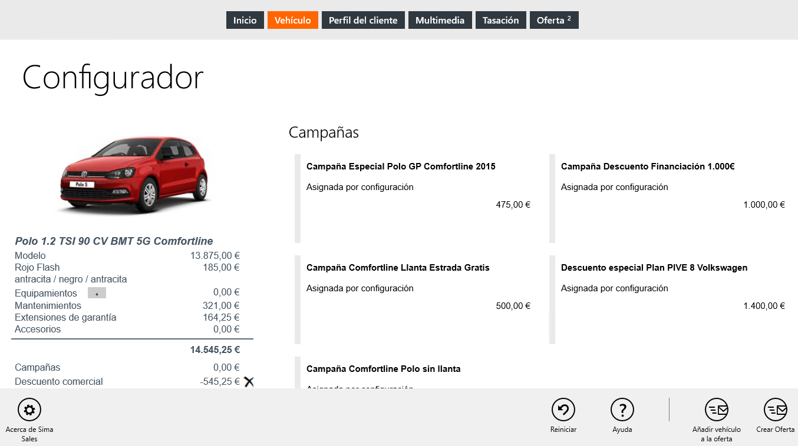

  
  

  
  
To sell a vehicle configuration we have to apply filters of _Model_, _Versions_, _Fuel_ and _Engine_ and then tap on _Configure_ in the commands bar.    
  
  

Then we will follow these steps:  
  
 **1.** Select _Color_ and _Interior_ (compulsory).  
 **2.** Select _Equipment_.  
 **3.** Tap on _Other services_ in the commands bar and add _Campaigns_, _Maintenances contracts_, _Warranty extensions_ and _Accesories_.  
 **4.** Select a financing option.  
 **5.** Add the vehicle to the **Offer** page (to compare with other vehicles).  
 **6.** Tap on _Create offer_ in the commands bar.  
  
 **First Contact** lets you insert a special discount on the total amount of the vehicle.

