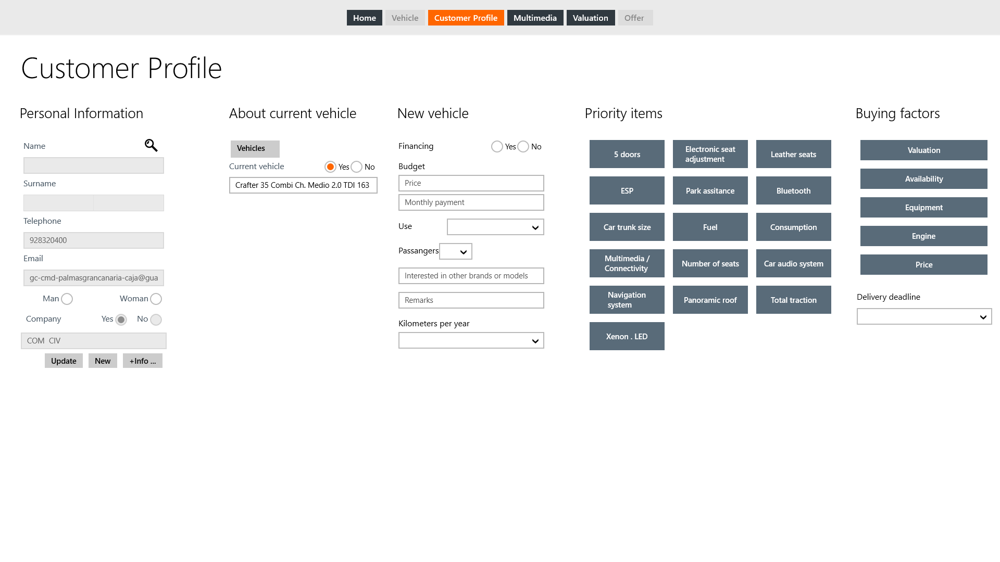
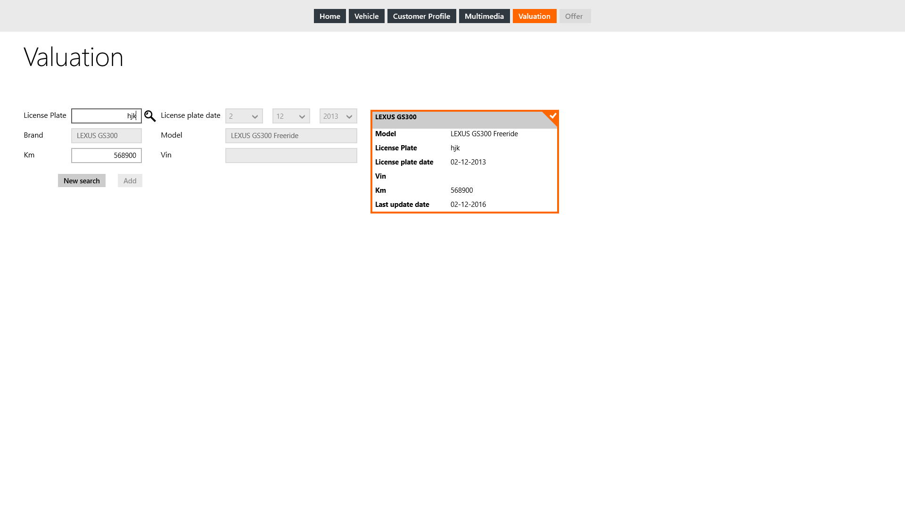

    
  
      
  
**First Contact** gives us the chance to select and  make a valuation of the vehicles of our customer as parti of the sales process. To valuate a vehicle we have to follow these steps:
 
 1. Access to  **Customer Profile**.    
 2. Search our customer information card and select it.   
  

  

 3. Access to **Valuation** page.  
 4. Select the vehicle chosen for valuation  
 5. Add kilometers.  
 

  
  
Los datos necesarios del vehículo seleccionado para su tasación serán enviados al crear la oferta.
