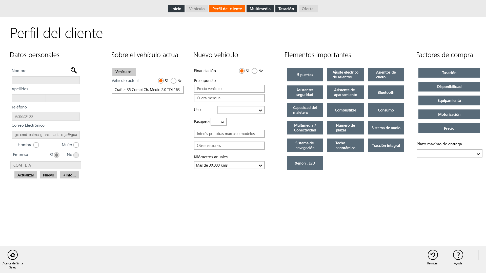
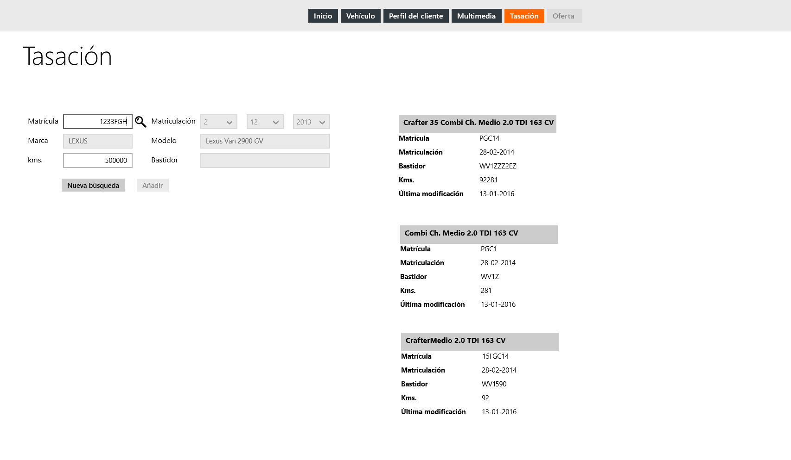

      
  
**First Contact** nos permite añadir vehículos del cliente para su tasación como parte  del proceso de venta.  Para tasar un vehículo debemos seguir los siguientes pasos:  
 
 1. Acceder a **Perfil Cliente**.    
 2. Buscar el nombre del cliente y seleccionarlo.   
  

  

 3. Acceder a la página **Tasación**.  
 4. Seleccionar el vehículo para la tasación.  
 5. Insertar el kilometraje.  
 

  
  
Los datos necesarios del vehículo seleccionado para su tasación serán enviados al crear la oferta.

