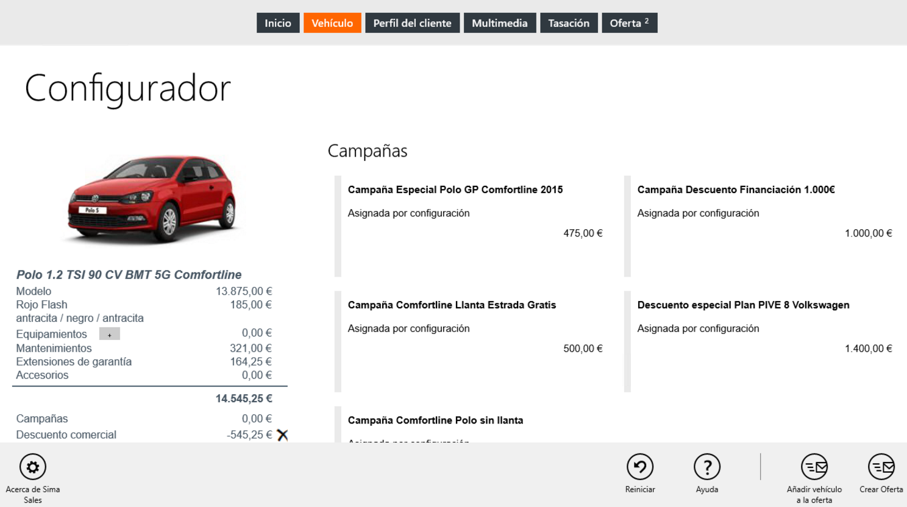

  
  

 
  
Para configurar un vehículo debemos aplicar los filtros de _Modelo_, _Versiones_, _Combustible_ y _Motorización_ y pulsar _Configurar_ en la barra inferior de comandos.      

    
  
Entonces, seguiremos los siguientes pasos:
  
 **1.** Seleccionar _Color_ e _Interior_ (obligatorio).  
 **2.** Seleccionar _Equipamientos_.  
 **3.** Pulsar _Otros servicios_ en la barra de comandos y añadir _Campañas_, _Contratos de mantenimiento_, _Extensiones de garantía_ y _Accesorios_.  
 **4.** Seleccionar una financiación.  
 **5.** Añadir vehículo a la página _Oferta_ (para compararlo con otros).  
 **6.** Crear la oferta.  
  

 **First Contact** le permite ofrece un descuento comercial sobre el importe total del vehículo.

  

  

  

  
