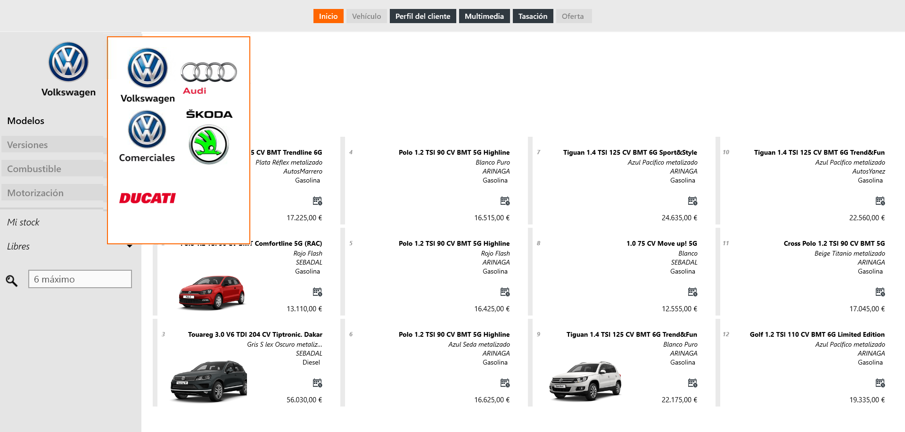

**First Contact** nos muestra en la pantalla de _Inicio_ los vehículos de stock y pedidos, ordenados por prioridad de venta (antigüedad).   
  
## Vehículos de stock y pedidos 
  
La página de _Inicio_ nos permite seleccionar vehículos de stock y pedidos y, además, aplicar filtros de _Mi stock_, _Mis pedidos_, mi _Stock de red_ y mis _Pedidos de red_ para facilitar nuestra búsqueda.

 
  
Para vender un vehículo de stock o pedidos debemos realizar los siguientes pasos:   
  
 **1.** Seleccionar un vehículo.  
 **2.** Seleccionar _Campañas_, _Extensiones de garantías_, _Accesorios_ (optativo).  
 **3.** Seleccionar una financiación.  
 **4.** Añadir vehículo a la página _Oferta_ (para compararlo con otros).  
 **5.** Crear la oferta.    
  
  Encontraremos las opciones de _Añadir vehículo a oferta_ y _Crear oferta_ en la barra inferior de acciones.
  

