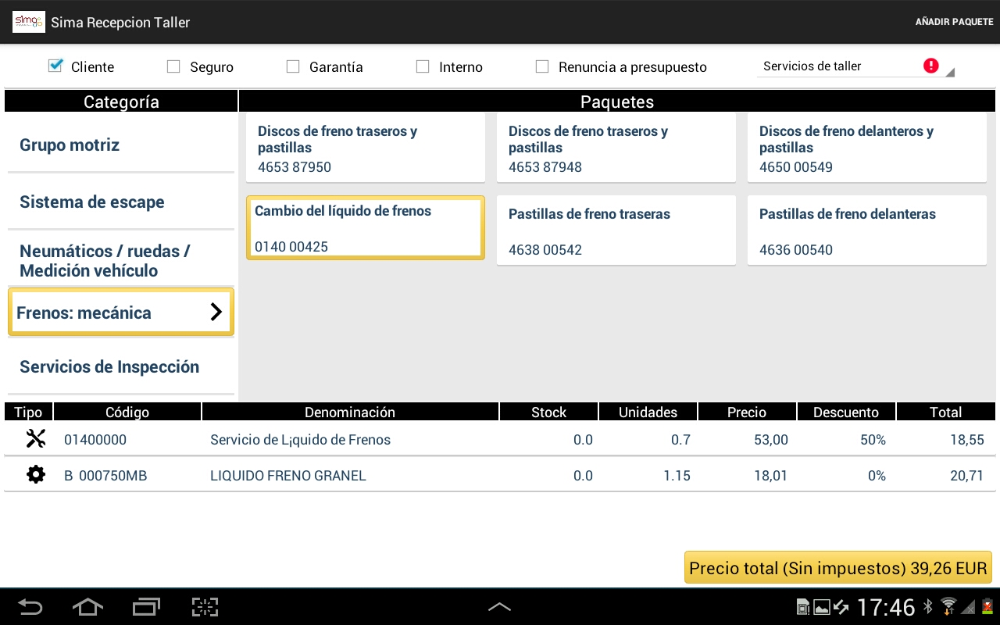

      
  
---  
 
## Active reception   
  
 
  

**Active reception** lets us apply the _control points_ of our workshop to the current vehicle.

  

To add _jobs previously agreed_ with our customer during the reception we can:  

>  Create job.  
>  Create Precises.    
> - Work with **PPSO** and *Active Selling** packages.   
  
### PPSO and ACTIVE SELLING packages  
  
We can access the **Active Selling** and **PPSO** for the vehicle we are currently receptioning just by tapping the corresponding labels on the top bar.  

   
   
**ACTIVE SELLING**   
   
      
  
**PPSO**  
  

    
  
  
### Documentas related  
  
In **Documents related** we can access to all documents (Word, Excel, PDF) that have been uploaded and linked to a certain job (sales pitch), and check them at anytime.

     
  
Afeter **adding a document**, ti will be displayed a text noting how many documents are linked to a certain job. 

 
  A meaningful name helps to find your documents easily and faster.
  
  

   

