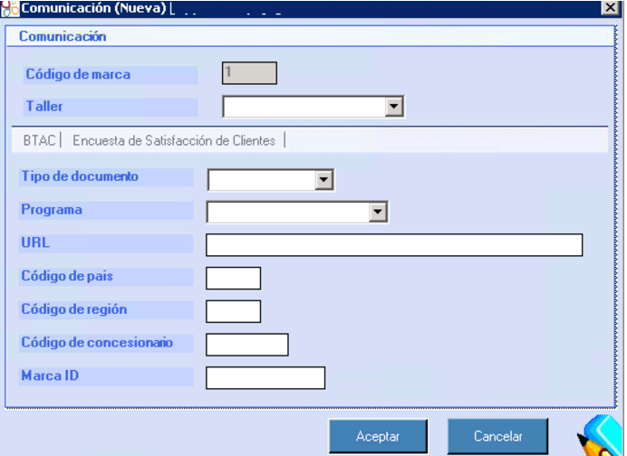
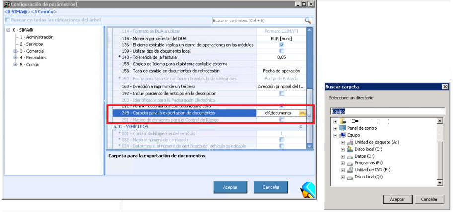

  
  
---    
  
   

  
**PRE REQUISITES**    
  
**Mobile Workshop** needs the following configurations to start working with the associated systems.  
 
## TABLET  
  
 
### Unknown sources    
  
 In our tablet we will change the settings of _Unknown sources_. To do so we have to:  
  
 > **1.** Tap on  _Settings/Security/Unknown sources_ and switch on _Unknown sources_.  
 > **2.** Download and install _SimaRecepcionTaller-release.apk_ from the service url (depending on the instalation). This step only needs to be done once.  
  
  
**Mobile Workshop** requires permissions to _Access the camera_ of the tablet and _Files Access_.
  

 If the application doesn't ask for permissions, we have to set them manually. To do so, we will go to:  
   
> _Settings/Applications/SimaRecepcionTaller_.    
  
  
### Saving the signature of the advisor  
   
Now we have to save the signature of the advisor in order to include it  in the signed order. We have to follow these steps:  
   
 > **1.** Go to _Preferences_ menu.  
 > **2.** Tap on _User preferences_ (topbar, right corner)  
 > **3.** Create a sign for our signature.      
 > **4.** Tap **Save preferences**  to save our sign (tools bar, on the rigth).  

 **Reset** will delete the signature previously created.  
  
## Automatic updates

 To set the automatic update of the tablet, we have to:  

 
  - Add the **service IP** in the field _Gen_Webservices_Parameters_ of the table _Nueva_Central.dbo.Gen_Webservices_Parameters_ of  _WorkshopTabletAndroidDeploy_ for this environment.  
  
IP forat must be as follows:  http://192.xxx.y.zzz/WorkshopTabletAndroidDeploy/:)  
  
## SIMA  
  
 **SIMA** also requires some modifications in the following configurations and parametres:
  
 > - **Handwriting signature:** parametre 246.  
 > - **RPath to save the signed order:** parametre 248.    
 > - **Interfaces by brand:**   _PPSO_, _Active selling_ and _ElsaR_, and the packages and _market campaigns_.  
 >> - **Service url** to _ActiveSellingServices_  and _WorkshopServices_.  
 > **Documents path**: path to save the _signed orders_ and the _sales pitch documents_.
  
### Handwriting signature
  
 **Handwriting signature** has to be managed from _SIMA/Services/Configuration_ and set the **parametre 246** (activate signature).
  
  
Handwriting signature will be ser only once.  

 Seding the order by email isn't requested.

  
**Customer signature**  
  
The **customer signature** will be activated configuring the parametre 246. 
  
  
  

 This configuration is unique for all users. We will set it only once.    
 
### Interfaces by brand  
  
The services of PPSO, Active Selling, Elsar and the _market packages_ and _campaigns_ **are only available by brand**.   
  
To **conigure brands** we will go to _SIMA/Services/Configuration/ Configuration (tools bar)/Brands_.  
  

  
  
Once we have done the previous steps:  
  
 > **1.** Click on right buttom on a brand.   
 > **2.** Click on _See brand_.    
  
In the **Workshop tab** we will configure the different services (see table) setting the service url for _ActiveSellingServices_  y _WorkshopServices_.  
  
**Create a new configuration**  
  
To create a ^**New configuration** we will click rigth buttom on teh grid and then select _New_.  
  

  
  
  
Now we will configure the fields according to the service. Then press _Accept_.  

  
  
  

### Documents of the order
  
The **documents of the order** used in Mobile Workshop are _signed orders_  and the documents of _sales pitch_. Both documents have to be saved in different paths.  
 
  
**Signed orders**  
  
In order to set the path for saving the _signed orders_, we will follow these steps:
  
 > **1. Create folder** to save the orders in a _Network path_ with _read and write permissions_ for the user running the web services.
 > **2. Configure in SIMA 1* the folder for the signed orders, _parametre 248_ (StorageDocumentPath).  
  
    
    

**Sales pitch**  
  
The **sales pitch** are those documents used by the adviser to sell services to our customer during the vehicle reception process.  
Before accessing these documents we have to:
  
 > **1. Create the folder** as _network path_ with _read and write permissions_ for the suer running the web services and the _users creating sales pitch_ documents.  
 >**2. Sharing the folder** as _network resources_.
 > **3. Configure SIMA 1** in _Service/Settings/Parametres/ Service/_ and then we will modify the _parametre 182_  (ServiceDocumentRepository).    
  

 the networks path format has to include the domain. For example, given the path _\\fs\RepostoryServices_ we will name it _\\fs.gda.dis\RepostoryServices_ where gda.dis is the domain.    
  
 > **4. Activate the database of Netbios:**    
 >>_UPDATE INT_EXP_Data_Provider SET Active = 1 WHERE ServiceTypeId = 11_    
    
 > **5. Configure a domain user** to access to the  _Repository of Service Documents_:  
 >> _update C set C.ParameterValue = @UserDomain 
from  INT_EXP_Data_Configuration C
    inner join INT_EXP_Data_Provider P on P.ProviderId = C.ProviderId 
where P.ServiceTypeId = 11 AND ParameterId = 21_   
  

 Format for **@UserDomain**  is _DOMAIN\user_. For example: IMPORTADORA\genericuser  
  
 > **6. Configure password for the domain user** in the database to access the _Repository of Service Documents_.  
 >> _update C set C.ParameterValue = @Password 
from INT_EXP_Data_Configuration C 
inner join INT_EXP_Data_Provider P on P.ProviderId = C.ProviderId 
where P.ServiceTypeId = 11 AND ParameterId = 22_ 
  
 

 We will click on  **ellipsis** points to access the documents.  
  
### Configuring the appointments    

The **configure appointments** process requires to _create a folder_ (exported documents folder) where the appointments will be saved.  

Once we have done that, we have to:  
  
 > - Give **read and write access** to the user running _WorkshopServices_.  
 > - **Configure the folder** in SIMA 1 in  _Service/Settings/Paametres/ Commons/_ then the _parametre 248_ 
  

  
## MOBILE WORKSHOP  

 Then we will run **Mobile Workshop** to configure the following parameters:  
  
 > - **SQL** and **IP** of the server (depending on the installations).  
 > - **Port** of the instance de la instancia (depending on the installations).  
 > - **Signature of the adviser** in  _User preferences_ (step previously done).    
  
**RABBITMQ**  
To be able that the adviser receive notifications in real time it is necessary to RabbitMQ and configure in SIMA where it is installed this server.

The path to configure is amqp://aidadesarrollo:123456@{0}:5672, where {0} is the server where RabbitMQ is installed.
