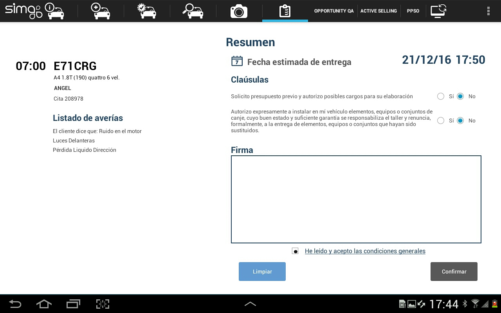

    
  
---  
  
## Validating jobs  

**Validating jobs** with the customer closes the reception process by getting the signature of our customer in order to comply the estimated jobs.  
  
 

The summary and compliance form is accesible by tapping on      
  
Once _the customer has signed_ we can:  

> - **Send an email** to our customer with the summary of planned jobs and his/her signature.  
> - **End the recepction** of the vehicle.    
  
 Once signed the order will be saved independently if we will send it or not by email.  
  
  
### List of jobs 
  
The **list of jobs** ca be checked on the left side of the validation form.

If we add _jobs of campaigns_ already applied, **Workshop Mobile** will notify us.  

 Jobs added during the reception will not appear until we save them.  
  
---    
  

  
## SIMA 1 - Order validation  
  
 **Order validation** made in Mobile Workshop can be access for checking purpose form SIMA 1:    
  
 **1.** Open SIMA and enter _Services_ module.  
 **2.** Open the _Adviser_ panel.   
 **3.** Open an _Order_ and then press _See reception_ (rigth buttom).  
 

  
.  

