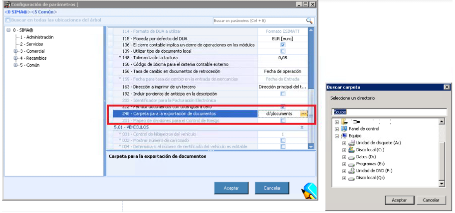

  
  
---    
  
   

  
**REQUISITOS PREVIOS**    
  
**Mobile Workshop** requiere de las siguientes configuraciones para poder trabajar con los sistemas asociados.     
 
## TABLET  
  
 
### Orígenes desconocidos    
  
 En nuestra tablet de trabajo cambiaremos los ajustes de _Orígenes desconocidos_. Para ello tenemos que:  
  
 > **1.** Ir a  _Ajustes/Seguridad/Orígenes desconocidos_ y habilitar _Orígenes desconocidos_ .  
 > **2.** Descargar e instalar  _SimaRecepcionTaller-release.apk_,  desde la url de servicio (según instalación). Este paso sólo se realiza una vez.  
  
  
**Mobile Workshop** nos solicitará, a continuación, los permisos de _Acceder a la cámara en la tablet_ y _Acceso a ficheros_.   
  

 Si la aplicación no solicita los permisos anteriores, debemos habilitarlos nosotros. Para ello, accederemos a:  
   
> _Ajustes/Aplicaciones/SimaRecepcionTaller_.    
  
  
### Guardar firma del asesor  
  
Ahora debemos guardar la firma del asesor para poder incluirla en la orden firmada del cliente: Para ello debemos  
   
 > **1.** Ir al menú  _Preferencias_.  
 > **2.** Pulsar _Preferencias del usuario_ (barra superior, a la derecha)  
 > **3.** Firmar con nuestra firma y guardarla.      
 > **4.** Pulsar **Guardar preferencias**  para guardar nuestra firma (barra herramientas, derecha). 

 **Limpiar** borrará la firma creada.    
  
  
## Actualización automática de la Tablet

 Para habilitar la actualización automática de la talbet, debemos realizar los siguinetes pasos:  
 
  - Añadir la **IP de servicio** en el campo _Gen_Webservices_Parameters_ de la tabla _Nueva_Central.dbo.Gen_Webservices_Parameters_ de   WorkshopTabletAndroidDeploy para ese entorno.    
  
La ip debe terminar en _:)_. Ejemplo:  http://192.xxx.y.zzz/WorkshopTabletAndroidDeploy/:)  
  
## SIMA  
  
 **SIMA** requerirá también algunos cambios en las siguientes configuraciones y parámetros:  
  
 > - **Firma manuscrita:** parámetro 246.  
 > - **Ruta para guardar la orden firmada:** parámetro 248.    
 > - **Interfaces por marca:**   _PPSO_, _Active selling_ y _ElsaR_, y los _paquetes_  y _campañas de mercado_.     
 >> - **Url de servicio** para _ActiveSellingServices_  y _WorkshopServices_.  
 > **Rutas de documentos**: ruta para almacenar las _ordenes firmadas_ y los documentos de _argumentación de Venta_. 
  
### Firma manuscrita
  
 La **firma manuscrita** la gestionaremos desde _SIMA/Servicios/Configuración_ y  configurar el **parámetro 246** (habilitar firma).
  

Sólo estableceremos una vez la firma manuscrita.
        

 No es obligatorio enviar la orden firmada por correo electrónico.     

  
**Firma del cliente**  
  
La **firma de cliente** se activa mediante la configuración del parámetro 246 
  
  
  

 Esta configuración es única para todos los usuarios. Sólo es necesario establecerla una vez.    
  
 
### Interfaces por marca  
  
Los servicios de PPSO, Active selling, ElsaR así como los paquetes de mercado y las campañas **sólo están disponibles por marca**. Para **configurar marcas** accederemos a _SIMA/Servicios/Configuración/ Configuración (barra de herramientas)/Marcas_.  
  

  
  
Una vez aquí seguiremos los siguientes pasos:  
  
 > **1.** Pulsar botón derecho sobre una marca.  
 > **2.** Clic sobre Ver Marca.    
  
En la **pestaña Taller**, configuraremos los distintos servicios dentro de la tabla correspondientes a las _url_ de _ActiveSellingServices_  y _WorkshopServices_.  
  
**Crear nueva configuración**  
  
Para crear una _Nueva configuración_ pulsaremos el **botón derecho** del ratón sobre el grid y seleccionamos la opción **Nueva**.  
  

  
  
  
Configuramos los campos correspondientes en función del servicio y pulsamos el botón Aceptar.     
  

  
  
  
### Documentos de la orden
  
Los **documentos de orden** con los que trabaja Mobile Workshop son las _ordenes firmadas_ y los documentos de _argumentación de Venta_. Ambos deben guardarse en rutas específicas.  
  
**Órdenes firmadas**  
  
Para establecer la ruta dodne se guardarán las órdenes firmadas, seguiremos los siguientes pasos:    
  
 > **1. Crear Carpeta** para las órdenes en una ruta de red  con _permisos de lectura y escritura_ para el usuario que levanta el servicio de los web services.  
 > **2. Configurar en SIMA 1** la carpeta para las órdenes firmadas, _parámetro 248_ (StorageDocumentPath)  
  
    
    

**Argumentos de Venta**  
  
Los **argumentos de venta** son aquellos documentos a los que el asesor accede desde la tablet durante la recepción del vehículos.   
  
Para acceder a estos documentos, seguiremos los siguientes pasos:  
  
 > **1. Crear Carpeta** como ruta de red con _permisos de lectura y escritura_ para el usuario que levanta el servicio de los web services y los usuarios de red que crean argumentaciones de Venta.    
 >**2. Compartir la carpeta** como recuros de red.
 > **3. Configurar en SIMA 1**: accederemos a _Servicio/Configuración/Parámetros/ Servicio/_ y modificaremos el  _parámetro 182_  (ServiceDocumentRepository).    
  

 El formato de la ruta debe incluir el dominio. Por ejemplo, para la ruta _\\fs\RepostorioServicios_ usaremos la nomenclatura _\\fs.gda.dis\RepostorioServicios_ donde gda.dis es el dominio.  
  
 > **4. Activar la _base de datos de Netbios**.   
    
 > **5. Configurar un usuario de dominio** para acceder  al _Repositorio de Documentos de Servicio_.
  

 **@UsuarioDominio**  debe tener el formato _DOMINIO\usuario_. Por ejemplo: IMPORTADORA\usuariogenerico  
  
 > **6. Configurar contraseña de usuario de dominio** en la base de datos para accider al _Repositorio de Documentos de Servicio_.
  
 

 Para acceder a la ruta de los documentos pulsaremos los **puntos suspensivos**.  
  
### Configuración de citas    

 La **configuración de citas** requiere _crear una carpeta_ (carpeta para la exportación de documentos.) en la que se guardarán las citas creadas.  

Hecho esto, debemos:  
  
 > - Dar **acceso de lectura y escritura** al usuario que levanta _WorkshopServices_.  
 > - **Configurar la carpeta** en SIMA 1 en  _Servico/Configuración/Parámetros/ Comunes/_, _parámetro 248_ 
  

  
## MOBILE WORKSHOP  

 Ahora ejecutaremos **Mobile Workshop** en la tablet para configurar los siguientes parámetros:  
  
 > - **SQL** e **IP** del servidor (según instalación).  
 > - **Puerto** de la instancia (segun instalación):  
 > - **Firma del asesor:** en  _Preferencias usuario_ (paso realizado anteriormente).    
  
## OTRAS CONFIGURACIONES    
  
### Ley de protección de datos

La _Ley de protección de datos_  y las _claúsulas del contratos_ no tienen, en este momento, configuración desde SIMA 1. Mientras tanto, hay que realizar las siguientes modificaciones en la base de datos:  

 >> _select 'Ley de protección de datos' 
select TextoLeyProteccionDatos as Condition
from dbo.Gen_Parametros_

 >> _select 'Condiciones Generales de los contratos' 
select Contenido as Condition, Negritas as Bold, Subrayada as Underline, OrdenAparicion as [Order] 
from dbo.TAL_PersonalizacionDorsoDocumento
where (TipoObjeto in ('A', 'I' )) and (Anulado = 0) order by OrdenAparicion_  
  
### Configuraciones en el IISS

**MIME Type**  
  
 El **MIME Type** es necesario para descargar la aplicación de extensión _.apk_. de **Mobile Workshop. Para instalar los tipos MIME iremos a:  
  
 >  _Inicio/Administración de Internet Information Service (IIS)_  
  
En el apartado **IIS**  (según nuestro sistema operativo)  _entraremos en Tipo MIME_ y hacremos clic en _Agregar..._: 

 

   

 La configuración se puede hacer para todo el Home o exclusivamente para el servicio _WorkshopTabletAndroidDeploy_.   
  
**POOL DE APLICACIONES**  
 
Ahora tendremos que _Configurar un usuario de dominio_ con **permisos de administración** para levantar el pool de la aplicación Workshop y poder _exportar los documentos pdf_ asociados a la recepción de la Cita.

**RABBITMQ**  
Para que se puedan recibir los avisos en tiempo real para el asesor es necesario instalar el RabbitMQ y configurar en SIMA dónde se encuentra dicho servidor. 

El servidor a configurar es amqp://aidadesarrollo:123456@{0}:5672, dónde {0} es el servidor en el que está instalado el RabbitMQ.

  

