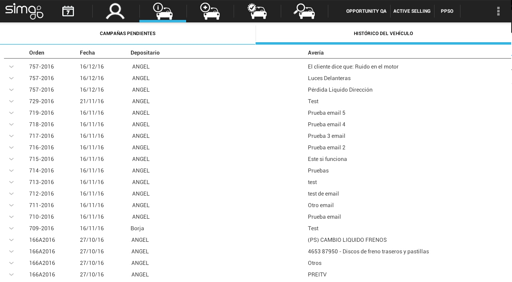

    
  
---  
  
**INFORMACIÓN DEL VEHÍCULO**    
  

  

**Información del vehículo** nos muestra el histórico del vehículo, con los _pases por taller_, los _trabajos realizados_ al vehículo de la cita y las _campañas de ELSAR.  

  

  
