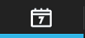

    
  
---  
  
## Panel de citas 
    

  
**Panel de Citas** nos muestra la relación de _Citas Previstas_ (por fecha) y el _Asesor_ asignado.    
  
    

Cada cita, nos dará información sobre si el cliente ha solictado _Taxi_ y acerca del **estado** de cada, cita según el siguiente código de colores:  

  - **Cita pasada**   
 - **Cliente en taller**  
 - **Cita futura**  
  

**Otras acciones** que podemos realizar en este panel son:  

> - **Seleccionar asesor**: acceso a las citas programadas para cada asesor.  
> - **Crear nueva "Recepción"**: realizar la recepción del vehículo para clientes sin cita y crear (posteriormente desde Sima) la cita.     
  

  

 Desde **SIMA Service** en el Gestor de Clientes, indicaremos que el _Cliente ya ha llegado al taller_.

## Recepcionar vehículos sin cita
  
**Recepcionar vehículos sin cita** es posible buscando por _tercero_ o _matrícula_ desde nuestra aplicación.  
  

  
  
  
Para ellos seguiremos los siguientes pasos:  
  
>**1.** Pulsar _Nueva recepción_.  
> **2.** Seleccionar el vehículo sin cita (de la base de datos).   
>**3.** Seleccionar el cliente.  
  
A partir de aquí, seguiremos _los mismos pasos_ que para recepcionar a un vehículo con cita.      
  
## Avisos  
  
El **Panel de citas** nos mostrará una aviso para las citas que hayan llegado. Puede ser en tiempo real(requiere configuración) o cada 2 minutos(comportamiento por defecto) ya sea porque lo indica el gestor de clientes o porque el lector de matrículas lo detecta.   

  

