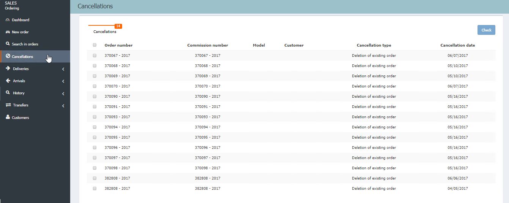

  
  
---   
  
   
  
**CANCELATIONS**

After placing our orders and sending them to the importer's system, we will receive an answer about the availability of our order.

    

Now, we access **CANCELLATIONS** and then check the responses of the importer system and click _Check_ in those orders that we want to manage.    
