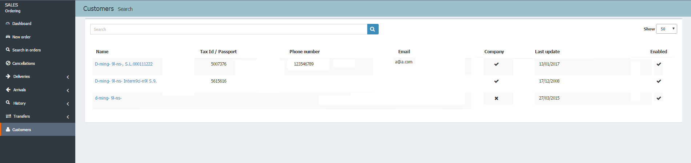
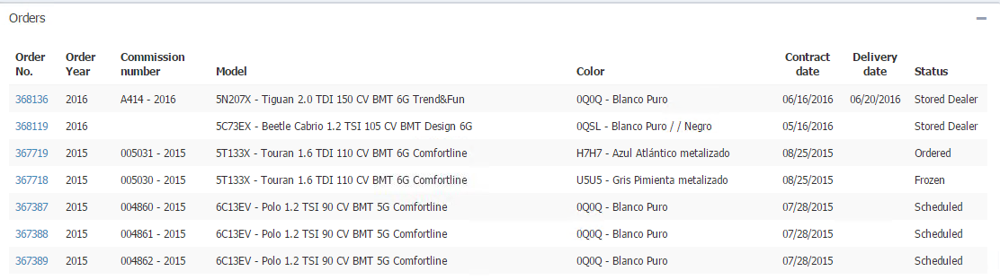

  

***

**CUSTOMERS**

**Customers** eases the management of our clients letting us to check and edit their information. To do this, we have to:

>

* Click **Customers** option in the menu.
* Select a customer to open the details page.
* Click _Go to customer detail_ in the order details page.

## Customer details

Here we can manage all the information related to the customer, _Data_, _New vehicles_ (Orders) and _Used vehicles_. In addition, we can perform the following actions:

  

