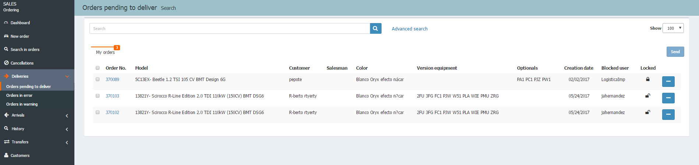

  
  
**SENDING ORDERS**

**Sending orders** is managed according to the type of order, which can be:
  
 - **Orders pending to delivery**.  
 - **Orders in errors**.  
 - **Orders in warning**.  

Each list of sent orders will show _different columns_ of information and the actions that can be performed.

