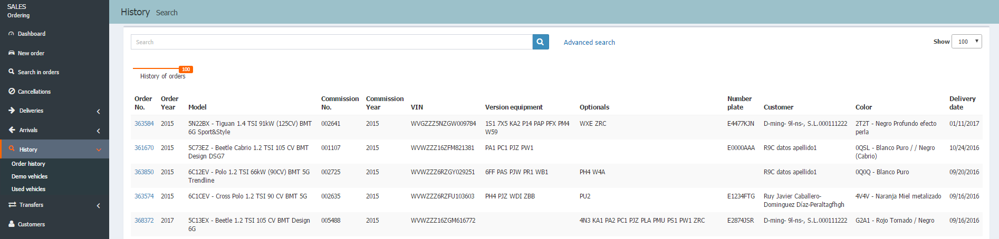
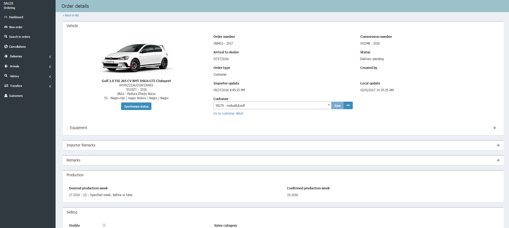
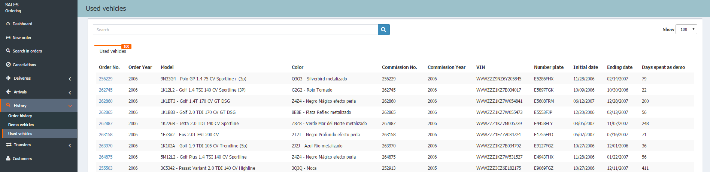

  
  
**History** shows a  list with the following information _Order number_, _Commission number_, _Description_, _VIN_, _Plate_, to manage orders of the following listings:  
  
 - **Orders history**.  
 - **Demo vehicles**.  
 - **Used vehicles**.  

## Orders history

In this list you can check all orders whose vehicles have already been delivered.

 From **Search in orders**, we can perform a search in the _History_, maintaining our initial criteria, by clicking on _Don't you find what you want?... Search in the orders history._.

## Demo vehicles

We can access the management page of _demo vehicles_ (active) from the **History** menu option and from the notifications box on the dashboard

In addition, we can perform the following actions:

**Customers**

 - Assign a new customer to a demo vehicle.  
 - Assign a current customer to a demo vehicle.  
 - Remove an assigned customer to a vehicle demo.  
 - Detach customer.  
 - Edit a customer assigned to vehicle demo.  

**Dates**  
  
 - Note the End date of demo.  
 - Note the Start date of demo.  
 - Note the Delivery date of demo. 
 - Assign Delivery date to demo vehicle.  

**Sellers and agents**  
  
 - Assign agent to a demo vehicle.   
 - Assign seller to a demo vehicle.  
   
### Deliver a demo vehicle

To deliver a demo vehicle, we must follow the following steps:  
>  **1.** Open the list of _Demo vehicles_.
 **2.** Click on the demo vehicle we want to deliver.
 **3.** Complete the required missing fields.
 **4.** Click on _Deliver_.

 The button _Deliver_ will display on the form the requested fields you still have to complete.

## Used vehicles

From the **History** option we can access the management of _Used vehicles_. Action also available from Notifications on the control panel.

