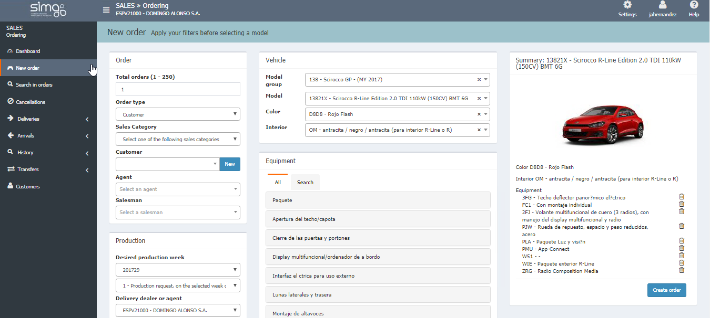

  
  
## New order

**New order** creates new orders with new configurations while _the rules of the catalogue are automatically applied_.

We will complete _the sections of the configuration_ from _left to right_.

If the vehicle doesn't have different available versions, we can configure a _base model_ .

**VALIDATE AN ORDER**

_Validate_ will check the configuration against the system of the importer and display the results of the check. In case of error, we can _Edit_ again our order.  

 _Validate order_ will be active if our dealer has the permissions to communicate with the manufacturer.

### Customer assigned to order

Regarding the customer assigned to an order, we will find the following situations when delivering the order.

> **1. Missing requested fields**  
  
>> **Ordering** will open the detail's page of a customer if, when completing an order, there are requested missing fields. Once the information is completed, we have to:
  
  
>>>**1.** Save our changes in customer's page.     
>>>**2.** Save the order.    
>>>**3.** Click _Deliver order_. this will previously check that all the requested fields are completed.    
  
> **2. No customer associated to order**.
  
If the order has no customer associated, we have to:  
  
>>>**1.,** Select a customer from the list.   
>>>**2.** Save changes in order.  
>>>**3.** Click on _Deliver order_ to verify the requested data.  
>>>**4.** Complete data and save.

