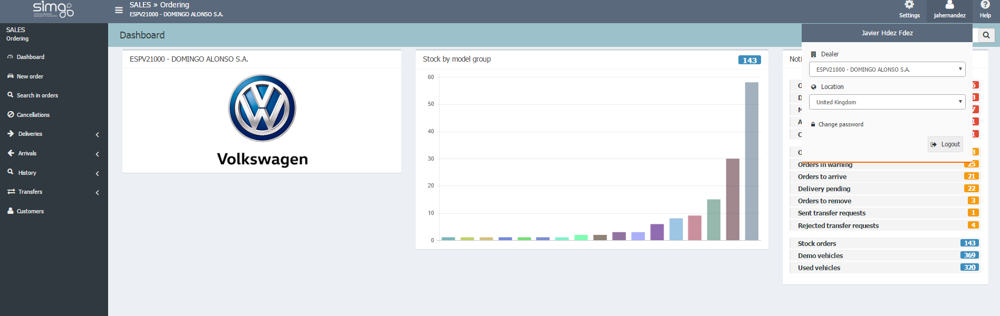

    
  
**ORDERING**

**Ordering** manages the creation of orders and the delivery process as well as the _customer information_ and the _management of users_, and _customers_. Ordering can also work with _different dealers_ and in _different languages_.

**Ordering** directly logs with our user and password (Desy logging). Then we can select our _Dealer_ and working language from the header of the page.

## Features

**Ordering** groups the features in the areas of _Header_, _Menu_ and _Working area_:

**Settings**

>

* Settings: manage users.
* User (name): select Localization (language) and dealer.
* Change password.
* User documentation.

**Dashboard**

>

* Notification of orders.

**Options menu**

>

* Create _New order_.
* Search in orders.
* Sending orders: management of _Orders pending to be send_, _Orders in error_ and _Orders in warning_.
* Orders at arrival: management of _Orders pending to arrive_, _Orders pending to arrive in 5 days_ and _Orders pending to be confirmed_.
* History: check the _Orders history_, _Demo vehicles (active) and Used vehicle_.
* Transfers: _management of our sent transfer request_ and the _transfer request we have received_.
* Customer: manage customers

 **Ordering** works with the _Catalogue_ of products and applies the rules we have previously defined in it. We will get a warning or an error message if there is a catalogue conflict during our work.

