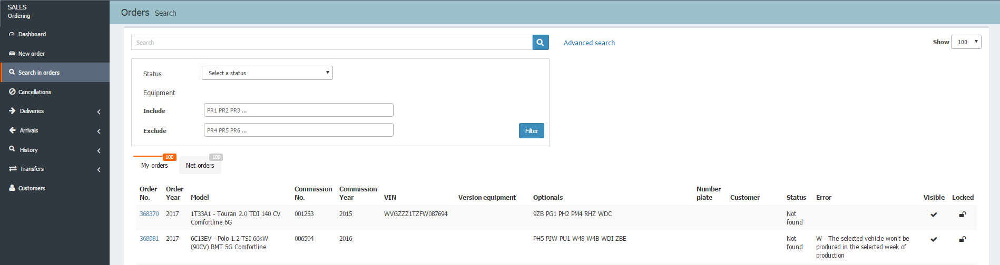
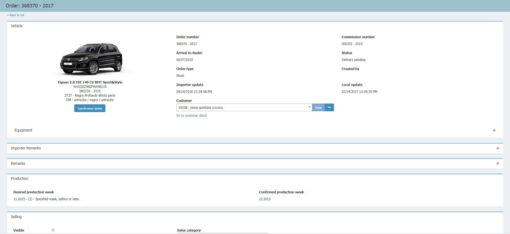
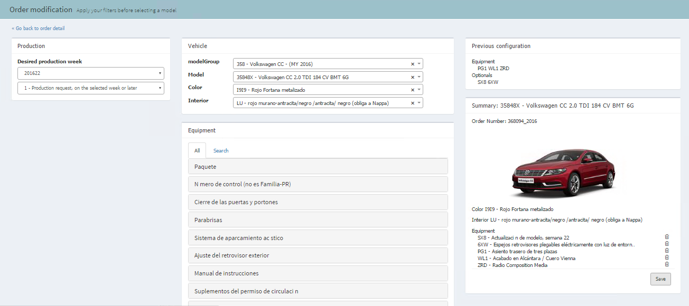
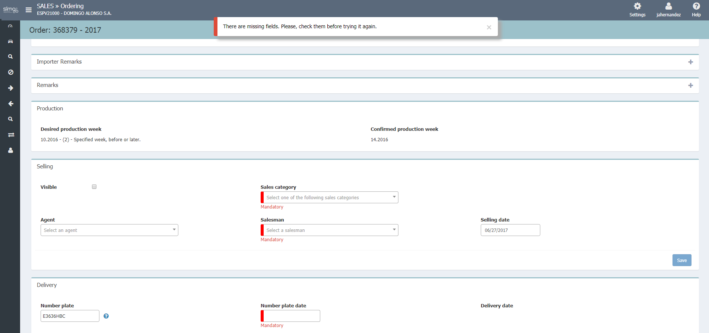

  
  
**SEARCH IN ORDERS**

**Search in orders** lets us to search by the fields of _Order number_, _Commission number_, _VIN_ and _Description of the model_ of the vehicle of our order. Additionally, we can also perform _Advanced search_ for equipment.

By clicking on the _order number_, we will open the details page.

We can visualize the list of _our orders_ and the _network orders_ and filter by the _state of the order_.

 Idea We will search in the orders **History** those orders that are not displayed on the list by clicking the link _Don't find what you want?... Search in the orders history_.

## Order details

**Order details** is the page where we can perform the following actions: _Manage the sale process_ and _Modify the order_ (configuration)

## Sales management

**Sales management** is the process that we perform on the _Details page_ of the vehicle by checking the following sections of the order:

> **1. Vehicle:** summary of the configuration of the vehicle.    
**2. Emissions and consumption.**
**3. Importer remarks**  
**4. Remarks.**  
**5. Production:** production details of the vehicle.  
**6. Sales:** details of the sale of the vehicle (visibility, agent, type of sale, etc.).  
**7. Delivery:** delivery details.  
**8. Errors summary.**  
**9. History of the order.**  
  
  
### Actions on orders 
  
**According the type and status of the order** the available actions are:
  
  - **Synchronize status** of the order.  
  - **Go to customer details** of the vehicles.  
  - **Request order**.  
  - **Remove**.   
  - Multioption button: Save, Remove, New, Edit.

 If we don't assign a customer _to an order_ the order will be displayed as _Visible_  in all the lists of orders.

## Edit order

To modify an order, we will _click on the order number_ or _VIN_ from any of the lists. Once the order is opened, we will click _Edit_.

Our _previous configuration_ will be always visible next to the changes we are doing.

In case we change the model of the vehicle, **Ordering** will note which elements of the equipment are not related to the new model.

 Remember At this moment, orders in the _Saved in Desy_ state are the only ones that can be modified.

## Deliver order

The process of delivery a vehicle or complete a delivery is performed as follows:

> **1.** Search vehicles.  
**2.** Filter _Delivery pending_. 
**3.** Complete the _Required fields_ in the section of **Delivery**. 
**4.** Save order. 
**5.** Press enter to validate the required data.

Once the delivery has been ruled out or complete, the vehicle will be added to the _History_.

