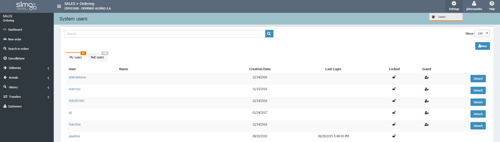

  
  
# Users management

**Settings** eases to manage our users by searching them in _My users_ (current dealer) or in _Network users_.

  
**Settings** let us perform the following actions:

 - Check _My users_ (current dealer) and _Network users_.  
 - Create new users.    
 - Invite a user of another dealer (network users) to my dealer.  
 - Detach guest users from my dealer.  

**Ordering** automatically checks that our user has the appropriate permissions to perform any action.  

 After inviting a user, Ordering opens the user details page so we can assign the corresponding permissions.

### Edit user

We will enter this window after clicking on an user name. Here we can:

**Personal data and Application data**  
  
 - Modify the data of the user (only my users).  
 - Change the default dealer for my users.  
 - Mark as _Seller_ a guest user in my dealer.  

**Permissions**  
  
 - Assign user management permissions to a user. 
 - Assign permissions for creating orders.  
 - Assign permissions for creating blocked orders.  
 - Assign permissions to remove only my orders or any orders.  
 - Assign permissions to check cancellations.    

**Ordering** automatically checks for compatibility issues of the permissions we are trying to assign.  

**Global actions**  
  
 - Save changes.  
 - Delete a user from my dealer.

 
