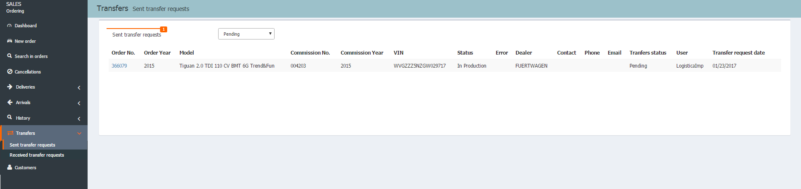
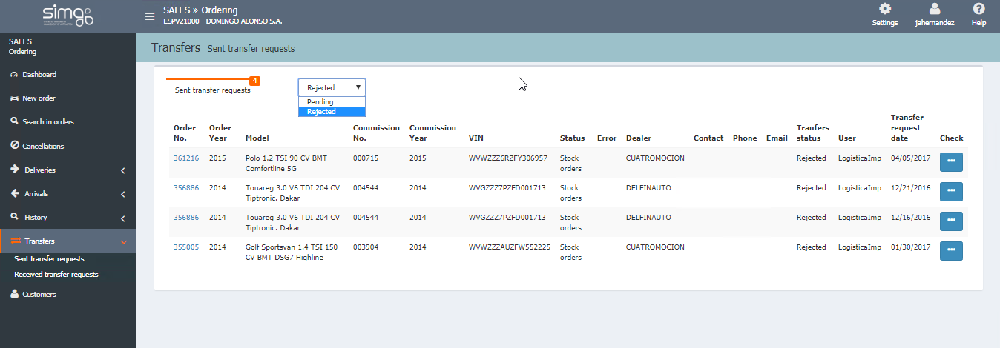
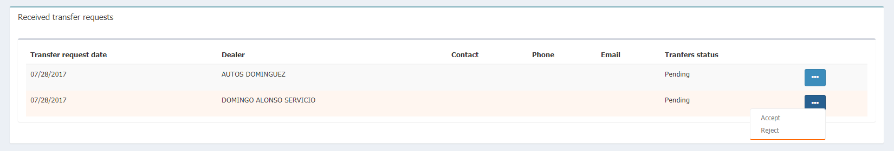

  
  
**TRANSFERS**

**Transfers** manage all the _Transfer requests received_ by our dealer and the _Transfer requests sent_ by our dealer, whenever our user has the _appropiate permissions_ .

**REQUESTS SENT**

## Send a transfer request

To send a transfer request of a vehicle from our dealer we must:

>

1. Search the order/vehicle by consulting the _Network orders tab_.
2. Access to the details page of an order from another dealer.
3. Click on **Request order**.

From the details page of an order we can see if _there is a transfer request_ upon our order.

 We can request _invisible orders_.

**REQUESTS RECEIVED**

## Manage transfer requests

We will manage the transfers request from the **Transfers** option in the menu. Then, we will chose one of the available option:  

 - Transfers sent.    
 - Transfer received.  

Afeter clicking on one of them, we will _click on a request** to open the details page. In the _transfers_ section we will manage the process:    
  

También podremos ver nuestras **solicitudes de cesión rechazadas**.

