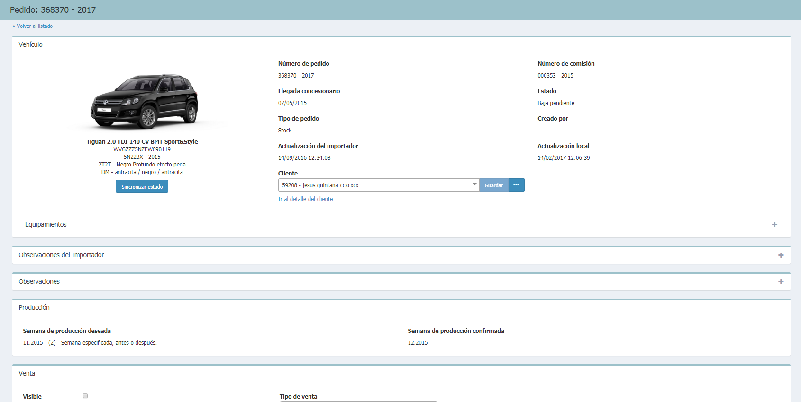
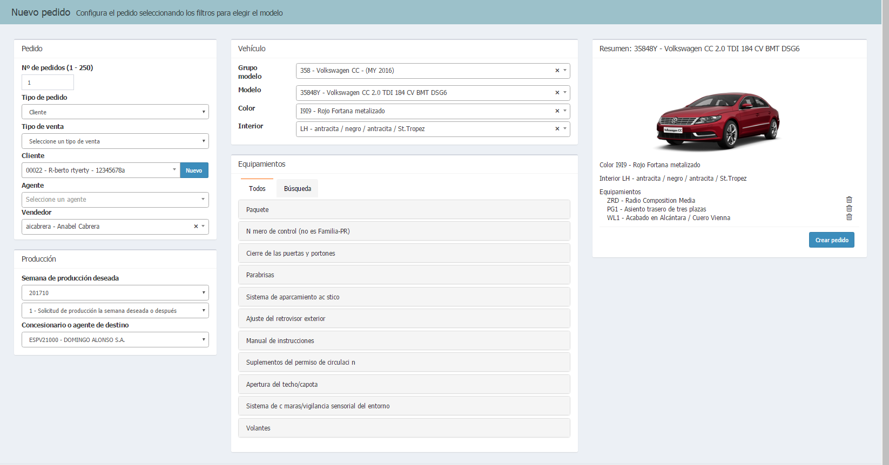
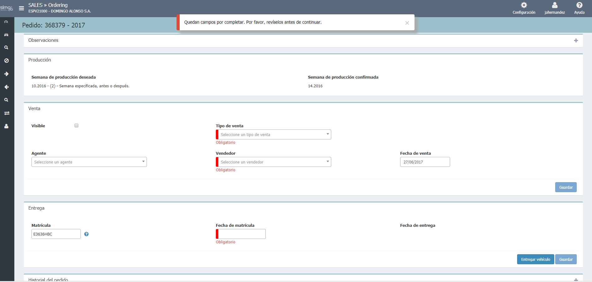

  
  
---  
  
**BUSCAR PEDIDOS**  

**Buscar pedidos** permite buscar por los campos de _Nº de pedido_, _Nº de comisión_, _Bastidor_ y _Descripción de modelo_ de nuestros pedidos.  Además, también podremos realizar _Búsquedas avanzadas_ de equipamientos. 
  
Al hacer clic sobre el _número de pedido_, accederemos al detalle de éste.
   

     
 
Podemos ver el listado de _Pedidos propios_ y de _Pedidos de red_ además de poder filtrar por el _estado del pedido_. 

 Buscaremos en el **Histórico** aquellos pedidos que no se muestren en los listado,  haciendo clic en _¿No encuentras lo que buscas?... Busca en el histórico_.    
  
## Detalle del pedido    
  
**Detalle del pedido** es la página que nos permite realizar las siguientes acciones: _Gestionar la venta_ y _Modificar el pedido_ (configuración).  

  
## Gestionar la venta 
  
**Gestionar la venta** es el proceso que realizaremos desde el _Detalle del vehículo_  mediante la consulta de la información del pedido en las siguientes secciones:  
  
>**1. Vehículo:** resumen de la configuración.     
>**2. Emisiones y consumo.** 
>**3. Observaciones del Importador.**  
>**4. Observaciones.**   
>**5. Producción:** detalles de la producción del vehículo.    
>**6. Venta:** detalles de la venta del vehículo (Visibilidad, Agente, Tipo de venta, etc.).    
>**7. Entrega:** detalles de la entrega del vehículo.      
>**8. Resumen de errores.**  
>**9. Historial del pedido.**     
  
### ACCIONES SOBRE PEDIDOS 
  
**Según el tipo y el etado del pedido** podremos realizar diferentes acciones sobre el pedido:  
  
  - **Sincronizar estado** del pedido  .  
  - **Ir al detalle** del vehículo.  
  - **Solicitar pedido**.  
  - **Borrar**.   
  - Botón multiopción: Guardar, Quitar, Nuevo, Editar.
  
   

 Si dejamos un pedido _sin cliente asignado_ mostrará el pedido como _Visible_ en los listados de pedidos.    
  
  
## Modificar el pedido   
  
Para modificar un pedido, haremos _clic en el número de pedido_ o _VIN_ desde cualquiera de los listado. Una vez dentro, pulsaremos _Editar_.     
  

En todo momento, veremos _Configuración previa_  y los cambios que vayamos realizando.   
  
**Ordering**, además, nos indicará qué equipamientos de mi vehículo no están relacionados con el modelo.
  
  
 Actualmente sólo pueden modificarse los pedidos  en estado _Guardado en Desy_, para ello.  
  
    
  
## Entregar un pedido  
  
Para entregar un vehículo (dar de baja un pedido) y finalizar así el proceso de venta, daremos los siguientes pasos:  
  
  >**1.** Buscar vehículo.      
 >  **2.**  Filtrar por _Baja pendiente_.  
 > **3.** Completar los _Campos obligatorios_ en la sección de **Entrega**.  
 > **4.** Guardar el pedido.  
 >**5.** Pulsar entrear para validar los datos obligatorios.  
  
 Una vez dado de baja, el vehículo pasará al _Histórico_.    

  

   

 

     

