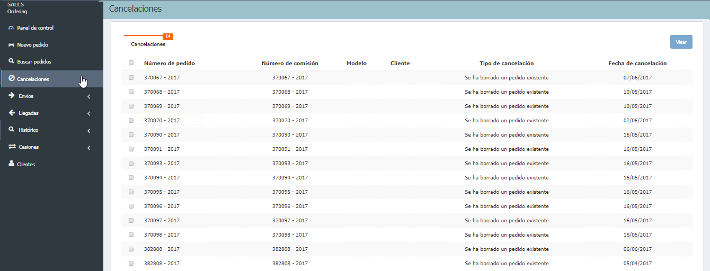

  
  
---     
  
**CANCELACIONES** 
  
Tras realizar nuestros pedidos y enviarlos al sistema del importador, éste nos responde acerca de la disponibilidad o no para confeccionar nuestro pedido.  

  
  
Ahora, accedemos a **Cancelaciones** donde debemos comprobar las respuestas del sistema del importador y hacer clic en _Visar_ en aquellos pedidos que queramos gestionar.  

 
  

