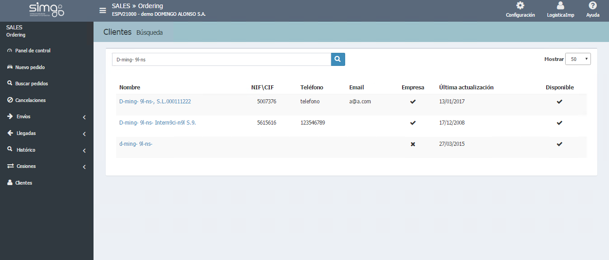
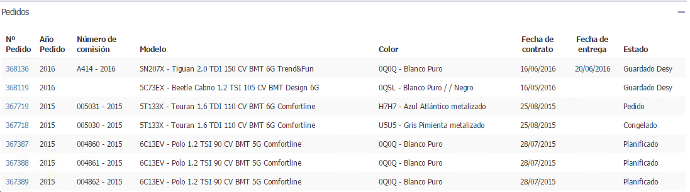

  
  
---  
  
**CLIENTES**  
  
**Clientes** nos facilita la gestión de nuestros clientes, pudiendo consultar y modificar sus datos. Para ello tenemos que:
  
>  - Clic en **Clientes** en el menú.  
> -  Seleccionar un cliente para abrir el detalle.  
> - Clic en _Ir a detalle de cliente_ desde el detalle de un pedido.    

   
  
## Detalle del cliente  
  
Nos permite gestionar toda la información vincualda al cliente,  _Datos_, _Vehículos nuevos_ (Pedidos) y _Vehículos de ocasión_. Además, podemos  realizar las siguientes acciones.:

   

  

