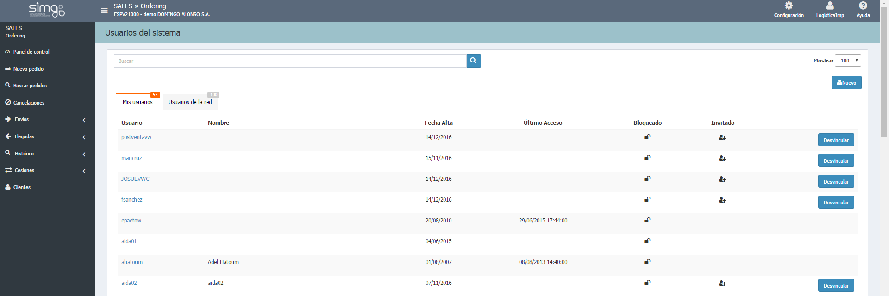

    
  
---    
  
# Gestión de usuarios
  
**Configuración** nos permite gestionar los usuarios de la aplicación mediante un buscador. Podemos buscar tanto en  _Mis usuarios_ (nuestro concesionario) o en los _Usuarios de la red_.    
  
    
  
**Configuración** nos permite realizar las siguientes acciones:  
    
> - Consultar _Mis usuarios_ (concesionario de trabajo) y _Usuarios de la red_.
> - Crear nuevos usuarios.    
> - Invitar a mi concesionario a un usuario de otro dealer (usuarios de la red).  
> - Desvincular de mi concesionario a usuarios invitados de otro dealer.    
 
**Ordering** comprueba automáticamente que nuestro usuario tiene los permisos adecuados para la acción que estamos realizando.  

 Después de invitar a un usuario, Ordering abrirá la página de edición de usuario para que asignemos los permisos del invitado.

  
### Editar usuario
  
 Entramos en esta ventana tras hacer clic en el nombre de usuario determinado.  Aquí podemos:
  
**Datos personales y Datos de la aplicación**
 
>- Modificar los datos del usuario (sólo de mis usuarios).     
>- Cambiar el concesionario predeterminado para mis usuarios.    
> - Marcar como _vendedor_ un usuario invitado en mi concesionario.        

**Permisos**  

> - Asignar permiso de gestión de usuarios a un usuario. 
> - Asignar permiso de creación de pedidos.  
> - Asignar permiso de creación de pedidos bloqueados.     
> - Asignar permisos para borrar sólo pedidos propios o cualquier pedido.  
> - Asignar permisos para comprobar las cancelaciones.  
    
**Ordering** comprueba automáticamente la compatibilidad de los permisos que  queramos asignar.  
  
**Acciones globales**  
  
> - Guardar cambios.  
> - Eliminar un usuario de mi concesionario.   

 
 

