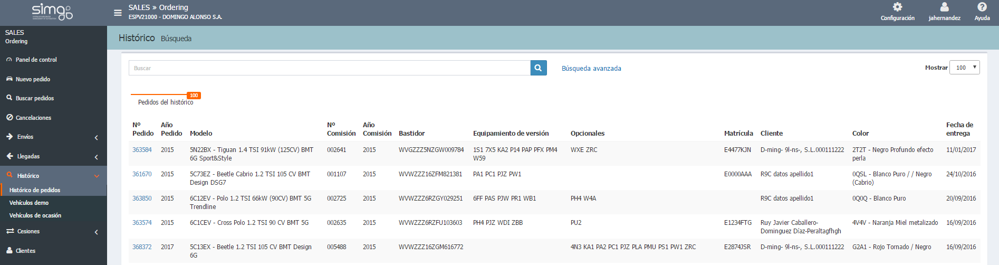
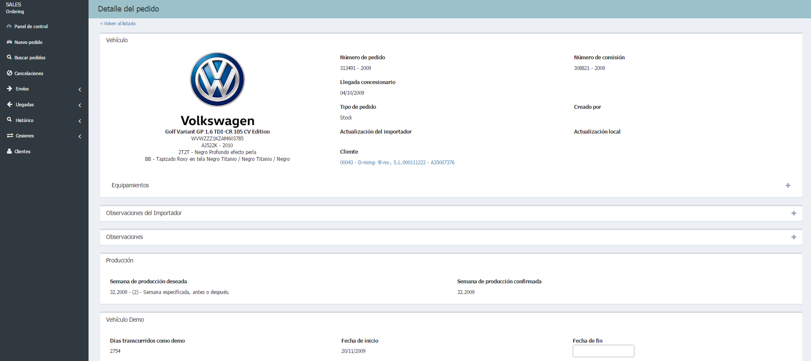
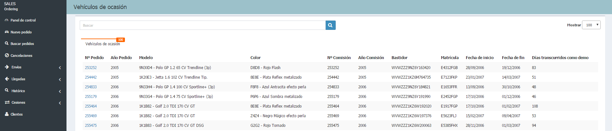

    
  
  
  
**Histórico**  nos muestra la información correspondiente a  _Nº pedido_, _Nº comisión_,  _Descripción_, _VIN_, _Matrícula_, para poder gestionar las pedidos de los siguientes listados:  
  
 - **Histórico de pedidos**.  
 - **Vehículos demo**.  
 - **Vehículos de ocasión**.    

## Histórico de pedidos       
  
En este listado podremos consultar todos los pedidos cuyos vehículos ya han sido entregados.    
 

 Desde el **Buscador de Pedidos**,  podremos realizar una búsqueda en el _Histórico_, manteniendo nuestros criterios inciales, haciendo clic en _¿No encuentras lo que buscas?... Tal vez esté en el histórico_ para buscar en el histórico.    
  

  
## Vehículos demo    
  
  
Podemos acceder a la página de gestión de _vehículos demo_  (activos) desde el menú **Histórico**  y desde las notificaciones en el panel de control.
  
  

Para ello podremos realizar las siguientes acciones:  
 
**Clientes**  
  
 - Asignar un cliente nuevo a un vehículo demo.    
 - Asignar un cliente existente a un vehículo demo.      
 - Quitar cliente asociado a un vehículos demo.  
 - Desasignar cliente.  
 - Editar cliente asignado a vehículo demo.    
 
**Fechas**  
  
  - Indicar fecha de fin de demo.
 - Indicar fecha de inicio de demo.
 - Indicar fecha de entrega de demo.     
 - Asignar fecha de entrega a vehículo demo.    
  
**Vendedores y agentes**  
  
 - Asignar agente a un vehículo demo.  
 - Asignar vendedor a un vehículo demo.  

  
### Entregar un vehículo demo
  
 Para entregar un vehículo demo debemos seguir los siguientes pasos:  
  
> **1.** Acceder al listado de _Vehículos demo_.  
> **2.** Hacer clic sobre el vehículo demo que queremos entregar.  
> **3.** Completar los campos obligatorios que falten.  
> **4.** Pulsar _Entregar_.    
  

 El botón _Entregar_  te indicará qué campos obligatorios faltan por completar.   
  

  
## Vehículos de ocasión  
  
Desde el menú **Histórico**  podemos acceder a la gestión de los _Vehículos de ocasión_. También desde las notificaciones en el panel de control.
  

