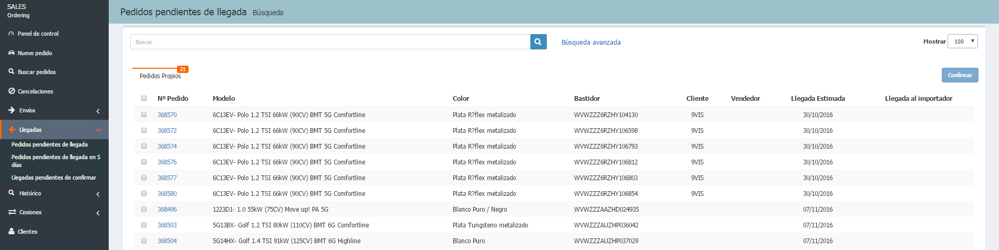

  
  
---  
  
**LLEGADAS**    
  
**Ordering** nos permite gestionar  las llegadas de nuestros pedidos, agrupadas en:  
  
 - **Pendientes de llegada**.    
 - **Pendientes de llegada en 5 días**.    
 - **Pendientes de confirmar**.    
  
  
 
Desde estos listados podremos _Confirmar_ la llegada de los pedidos, tanto de uno en uno como seleccionando varios.
  

