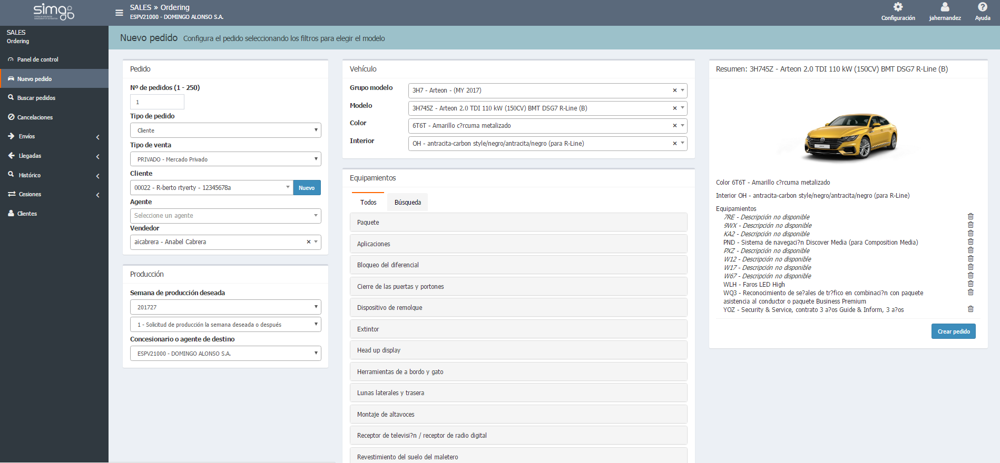

  
  
---  

## Nuevo pedido    
  

**Nuevo pedido** permite crear pedidos con nuevas configuraciones mientras  se _aplican automáticamente las reglas del catálogo_.    
  
Completaremos las  _secciones de configuración_  de _izquierda a derecha_. 
  
     
  
Si no se dispone de versiones de un vehículo, podremos configurar un _modelo base_ .    
  
**VALIDAR EL PEDIDO**  
  
 La opción _Validar_ comprobará la configuración en el sistema del importador  y mostrará por pantalla el resultado de dicha validación.   
  
En caso de errores, podremos _Editar_ nuevamente el pedido.

  

 Se activará  la opción _Validar pedido_ si nuestro concesionario tiene la posibilidad de comunicar con el sistema del importador.    
  

### Cliente asociado al pedido  
  
Respecto al cliente asociado, podemos encontrarnos las siguientes situaciones al entregar el pedido:  
    
> **1. Faltan datos obligatorios**  
  
>> **Ordering** nos abrirá el detalle del cliente si al entregarlo faltan datos por completar. Una vez añadida la información debemos:  
  
  
>>>**1.** Guardar los cambios en el cliente.    
>>>**2.** Guardar el pedido.    
>>>**3.** Pulsar _Entregar_ que comprobará automáticamente que tenemos todos los datos necesarios.      
  
  
> **2. No hay cliente asociado al pedido**
  
>> Si el pedido no tiene un cliente asociado, debemos:  
  
>>>**1.,** Seleccionar un cliente de la lista desplegable.   
>>>**2.** Guardar el cambio en el pedido.  
>>>**3.** Entregar el pedido, para verificar los datos obligatorios.  
>>>**4.** Completar y guardar los datos de cliente que falten.
  
  

  

  

