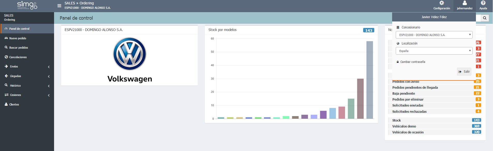

  
  
---    
  
**ORDERING**

**Ordering** gestiona los pedidos desde su creación hasta la entrega del vehículo, así como los _datos de clientes_, la _gestión de usuarios_, _gestión de clientes_  pudiendo _trabajar en distintos concesionarios_  y en _distintos idiomas_.
  

 
  
**Ordering** loguea directamente con nuestro nombre y contraseña de usuario (usuario y clave de Desy) y nos permite seleccionar _concesionario_ de trabajo e idioma desde la cabecera de cada página.  

  
  
## Funcionalidades  
  
**Ordering** agrupa las funcionalidad en las áreas de _Cabecera_, _Menú_ y _Área de trabajo_:  
 
  
**Configuración**    
  
> - Configuración: gestión de usuarios.  
> - Usuario: selección de localización (idioma), selección de concesionario.  
> - Cambiar contraseña. 
> - Documentación de usuario.  
  
**Panel de control**  
  
> - Notificaciones de pedidos.   
  
**Menú de opciones**  
  
> - Crear _Nuevos pedidos_.  
> - Buscar pedidos.  
> - Envíos: gestión de _Pedidos pendientes de envío_, _Pedidos con error_ y _Pedidos con aviso_.      
> - Llegadas:  gestión de _Pendientes de llegar_, _Pendientes de llegar en 5 días_ y _Llegadas pendientes de confirmar_.     
> - Histórico: consultar el _Histórico de pedidos_, _Vehículos demo (activos) y _Vehiculos usados_.  
> - Cesiones: _gestión de cesiones solicitadas_ y solicitud de _cesiones recibidas_.  
> - Clientes: gestión de clientes.  
 

  
 **Ordering** trabaja con el _Catálogo_ de producto y aplica las reglas que hayamos definido en él. Igualmente, nos avisará si existe algún conflicto o error.
      

  

