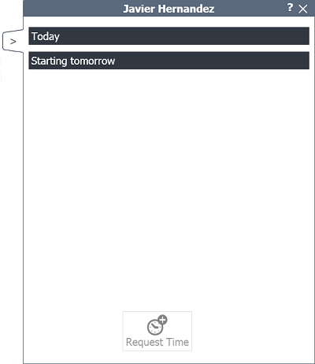

   
  
---  
  
**PANEL OF THE MECHANIC**  
  
**Panel of the mechanic** shows the jobs that the _Planner_ role has prioritized for a certain mechanic. In addition, we can see the following information:    

**-    - Orders.**   
**-   - Appointments.**    

We can also **request time** for a certain job.  

  

   

