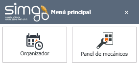

    
  
---  
  
**CONFIGURACIONES**   

Los productos de taller **ORGANIZER** y **Panel de Mecánico** permiten que solamente perfiles con determinados permisos trabajen con ellos.  

  

## ORGANIZER

**Organizer** sólo permite trabajar a aquellos perfiles de usuario que:  

 -  Tengan habilitado el permiso 2157.  
 -  No lo tengan denegado explícitamente.  

## PANEL DEL MECÁNICO  

**Panel del mecánico** sólo permite trabajar a aquellos perfiles de usuario que:  

 - Tengan habilitado el permiso 2066.  
 - No lo tengan denegado explícitamente.

