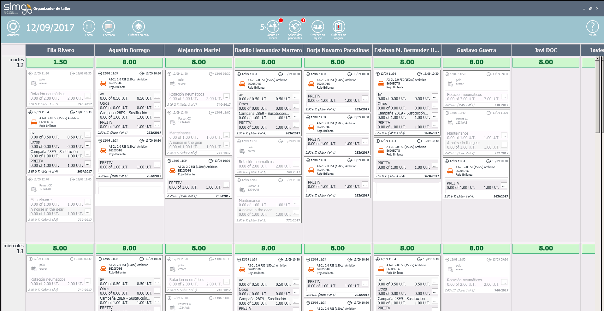

      
  
---  
  
# ORGANIZER  

**Organizer** gestiona nuestro taller gracias dos áreas bien diferenciadas, el Área de notificaciones y el Área de organización.  
  

  
  
**Organizer** nos permite gestionar los _Mecánicos_ de nuestro taller, los _bloques de trabajo_ y los _trabajos del taller_, todo ello agrupado por días.  
  
 
## Cabecera    

Situada en la parte superior de la pantalla, nos permite:  
 > 
 -  Actualizar el panel de organización.
  -  Seleccionar la fecha de partida para organizar el taller.  
 -  Seleccionar cuántas semanas de organización se quiere ver       .  
 -  Visualizar órdenes en cola.  
 -  Visualizar el número de clientes en espera.  
 -  Visualizar las solicitudes de tiempo de los mecánicos.
 -  Visualizar las órdenes que tienen trabajos asignados a equipos para re-asignarlos a mecánicos.  
 -  Trabajos sin asignar.
 -  Acceder a la documentación de ayuda . 

    
  

## Área de trabajo  

Situada en la parte central de la pantalla, nos muestra los _mecánicos del taller_, la _disponibilidad de los mecánicos_ y los _bloques de trabajo_ y trabajos para cada vehículo. Además, nos facilita información sobre:  
  
> - Órdenes:   
> - Citas:      
> - Averías repetitivas:     
  
 
   
También podemos consultar información sobre:  
  
> -   Fecha _Planificada de recepción_ y fecha de _Entrega_ del vehículo.  
> -  Trabajos iniciados y en los que se ha trabajado.  
> - Tiempo planificado para cada trabajo y bloque de trabajo.    
 
  

 El **Organizer** agrupa en la orden correspondiente, y automáticamente, las averías no priorizadas de una misma orden.

    
Y realizar las siguientes operaciones:   
   
 
>-  Visualizar los trabajos de una orden en el _miniorganizador_ (clic sobre la orden).  
-  Asignar un trabajo o bloque entre mecánicos (arrastrar y soltar).    
-  Priorizar los trabajos de los mecánicos (arrastrar y soltar en vertical).  
-   Partir el trabajo y modificar el tiempo planeado desde .    

 
 

 Los trabajos o bloques **no se partirán** si se asignan a un mecánico sin disponibilidad.  

