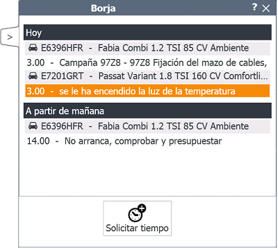

    
  
---  
  
**PANEL DE MECÁNICO**  

**Panel de mecánico** muestra los trabajos planificados y asignados para un mecánico.  
   
    
  
 
  
Además, visualiza junto la siguiente información:  
  
> -  **Órdenes**.   
> -  **Citas**.  
                 

También nos ofrece la posibilidad de **solicitar tiempo** para un trabajo en concreto.    

