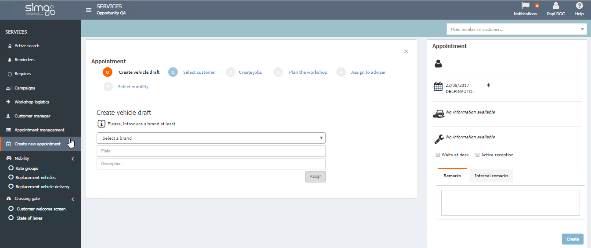
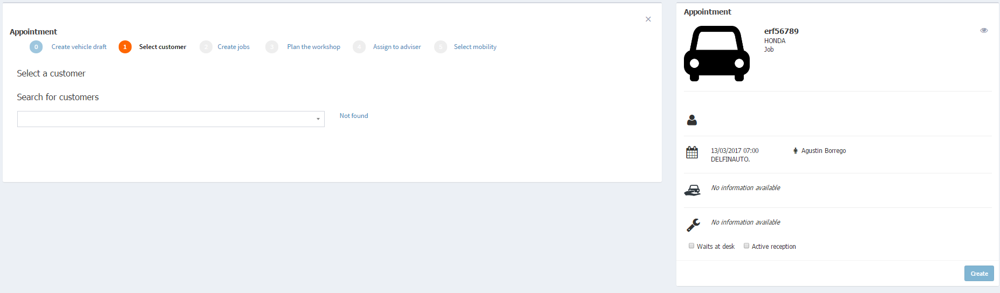

  
  
---     
  
## Create new appoinment 

**Create new appoinment** opnes the process for creating an appoinment for _unscheduled vehicles_ from the options menu (Create new appoinment).
   
  
  

 Your user must have specific permissions to create this kins of appoinments.  
  

### Create new appoinment: steps   

**0. Create draft vehicle** 

    
Select **Brand** and insert _plate_ and a _Description_ of the appoinment.  

    
  
**1. Select customer**   
  
then we will _search_ our customer in our system.  
  
    
  
If the customer isn't in our system we can create it clicking on _Not found_.  

**2. Create appointment**   
  
Select an available _Service_ and then the desired _Packages_, _Offers_ and/or _Campaigns_ for our current vehicle. Hese have been previously defined for our dealer to its brands.  
   
  
     

Clicking on **Shows more details** we can:    
  
 >- Select _Origin_ and _Type_ of job.  
 >- _Plan other time_ for the selected job.  
 >- Note that our customer _refuses estimate_ or not.   
  

 Packages, offers and free jobs will be added, created and modify individually.  
  
**Jobs** will be added even if they don't have defined _job positions_ . We can visualize them by clicking on 

  
 

**3. Plan the workshop**    

Now we will  _select individually_ every job, and then _assign it to a workshop team_ taking into account its availability. 

   
  
 To _modify the planning_ we will select a job and then a team.

  If we delete a job from the appoinment, we will have to recreate it in step 2.  

**4. Assign adviser**:
  
Select _Date and time_ and _Adviser_ from the menus or _Prioritize_ by adviser.

      
  

 If we modify the  duration of an appoinment, all the available appoinments will be automatically adjusted.
  
 

   
**5. Mobility**   
  
Select the _mobility option_ accepted by our customer between this three: _Not requested_ , _Replacement vehicle_ and _Taxi_.  
  
**Create** buttom will create the appointment and close the current process.   

 

 In the summary of the appoinment, we can note if our customer _Waits at desk_ or accept _Active reception_ services_.    
  
 
  
## Customer card
 

**Customer card** is available from the customer's card  in  , located on the right summary.
  
     
  
Here can make the following actions:  
  
 > - Add, modify and delete contact information.  
> > - Note remarks.  
> > - Note the preferred contact time of the customer.  
> > - Note the preferred contact media.  

> - Visualize customers addresses.
  
  
    

