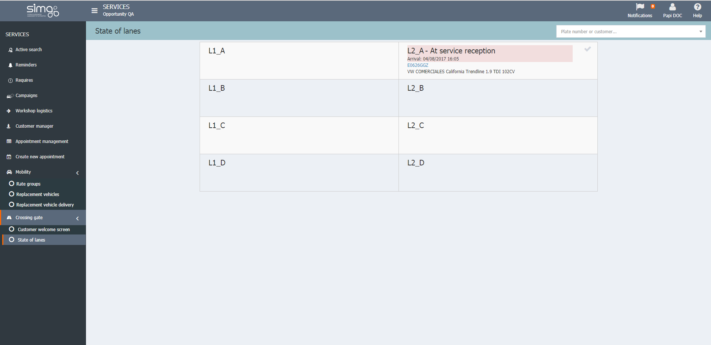

  
  
---    
  
  
  
---     
  
**CROSSING GATE**  
  
**Crossing Gate** let us check the current state of the lanes in the workshop.  
  

  
  
In addition, we can **change the state of the reception** of the vehicles and visualize the following information:  
  
 - **Lane Nº**.  
 - **State of vehicle**: _Receptioned_, _At reception_, etc.    
 - **Appointment information**.  
 - Vehicle information: plate and brand.  
   

