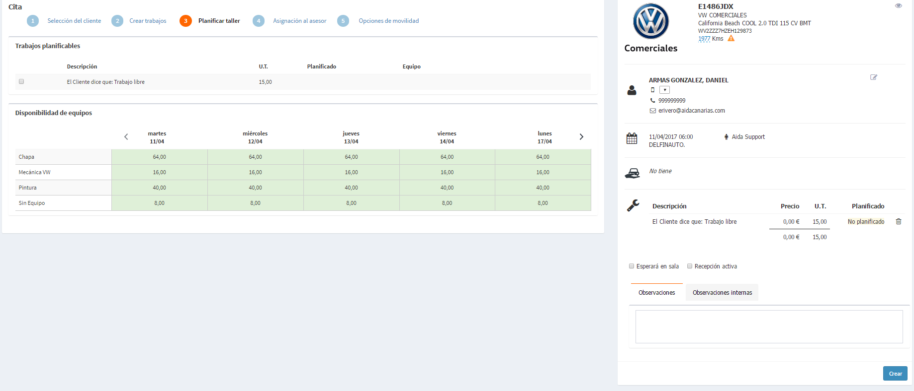
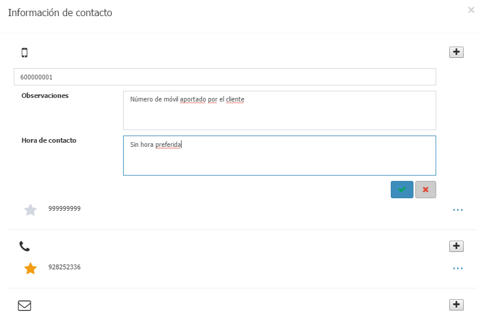

    
  
---
  
## Active search  

**Active Search** manages all the _customer card_ that have been estimated for a succesfull sale.  We will open it from the options menu and then select a _Maintenance service_.  

Every _customer card_ contains information about:   
  
 > -  **Depositary** and **Owner** of the vehicle.  
 > - **Vehicle information**: _Campaigns_, offers of _PPSO_ and _Active Selling_, and _Maintenances_.  
 > - **Sales pitch**: list of _Registers_ , _Warranties_, _Contracts_ and state of _Campaigns_:  
 >> - **Not performed**: application pending.    
 >> - **Planned**: campaign already added to the appoinment (damage not removed).    
 >> - **Performing**: incluída en una orden abierta (avería no anulada).   
 > - **Manufacturer offers**.  
 > - **Requires** noted in the workshop.
 > - Registered communications with the customers.  

For each customer card we can:   
  
 > - Note feedback from the customer (click on telephone number).    
 > - Check remarks related to the customer . 
 > - Check the workshop summary of the vehicle .  
 > - Create an appoinment for the customer .   

 The following icon is displayed when a customer does not want to be contacted  .   
  
    
    
## Jobs history  [sima2](images/en-EN_icons_See.png)

**Jobs history** displays the vehicle's planned appointments and past jobs, including jobs positions.   
  

  
## Create an appoinment 

**Create an appointment** starts the process of creating a new appointment from the _Customer card_ by clicking on .  During the process we can check the _Summary_ of the appointment always visible on the right side.  
   
Available actions:
  
 > -  - Access the history of jobs.   
 > -  - Edit the customer information .      
 > - Edit the estimated kilometres.  
 > - Select the contact telephone number for our customer.  
 > - Remove jobs from the order.
 > - Note if the _customer will wait at desk_ or accepted _Active reception_.  
 > - Add general _Remarks_  and  _Internal remarks_ to the order.
  
  

 Our user must have the required permissions to create appointments.    
  
  
### Creating an appoinment  

**1. Select workshop and customer**

    
Select **Select workshop** and a **Customer** from the menus or create a new customer by clicking the _Not found_ link in case the customer isn't not in the system.  

     
  

**2. Create appointment**   
  
Select an available _Service_ and then the desired _Packages_, _Offers_ and/or _Campaigns_ for our current vehicle. Hese have been previously defined for our dealer to its brands.  
   
  
     

Clicking on **Shows more details** we can:    
  
 >- Select _Origin_ and _Type_ of job.  
 >- _Plan other time_ for the selected job.  
 >- Note that our customer _refuses estimate_ or not.   
  

 Packages, offers and free jobs will be added, individually.  
  
**Jobs** will be added even if they don't have defined _job positions_ . We can visualize them by clicking on 

  
 

**3. Plan the workshop**    

Now we will  _select individually_ every job, and then _assign it to a workshop team_ taking into account its availability. 

   
  
 To _modify the planning_ we will select a job and then a team.

  If we delete a job from the appoinment, we will have to recreate it in step 2.  

**4. Assign adviser**:
  
Select _Date and time_ and _Adviser_ from the menus or _Prioritize_ by adviser.

      
  

 If we modify the  duration of an appoinment, all the available appoinments will be automatically adjusted.
  
 

   
**5. Mobility**   
  
Select the _mobility option_ accepted by our customer between this three: _Not requested_ , _Replacement vehicle_ and _Taxi_.  
  
**Create** buttom will create the appointment and close the current process.   

 

 In the summary of the appoinment, we can note if our customer _Waits at desk_ or accept _Active reception_ services_.    
  
  
## Customer card
 
**Customer card** is available from the customer's card  in  , located on the right summary.
  
     
  
Here can make the following actions:  
  
 > - Add, modify and delete contact information.  
> > - Note remarks.  
> > - Note the preferred contact time of the customer.  
> > - Note the preferred contact media.  

> - Visualize customers addresses.
    
  
## Feedback

**Feedback** eases writing the feedback of our customer just by clikcing on the _telephone number_:

     

Every feedback triggers an action in the system. 
 

 - Maintenance accepted - **This customer card will be display again** for the next maintenance.
 - Remember on _DD/MM/AA_ at _HH/MM_ - **A Reminder will be created for this appoinment**.  Open reminders will be dissapear from the list.
 - Contact me again - **The customer card will be displayd again** afeter rebot the application.  
 - Maintenance not required (select a reason) -**The customer won't abe displayed again** for the current maintenance.
 - No answer - **The customer card will be displayed again** in 5 days.  
  

 _Currents kilometers_ will recalculate the previously estimated date for maintenance plans.  

**Feedback** lets us note the intereset of our customer in any of the other maintenances. This information will update the **Communication** section of the card  
  
### Feedback for maintenances already planned

**SIMA Service** visualizes the first planned date for a maintenances.

  

The planned date for a maintenances will be shown in the _Maintenances_ section of a customer card by houvering the mouse.

  

  

