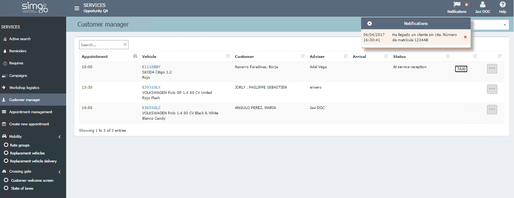

  
  
---    
  
## Customer manager  
  

**Customer Manager** shows us all the vehicles having an appointment for today and let customer manager check the status of the customer in the waiting room.   

  

**Customer Manager**  allow us say if a customer _Has arrived_ and we can also check the following information:  
    
 - Arrived, with date and time.  
 - If the vehicles is already At reception.
 -   Vehicle has arrived.      
-  Replacement vehicle information.
 -  Customer has requested a taxi.  
 -  Customer accepted active reception.     
  
## Replacement vehicle  
  
**Replacement vehicle** lets us see the reservation and deliver the vehicle to our customer. For more information see paragraph *Deliver replacement vehicle*.
  

  

  

  

 
