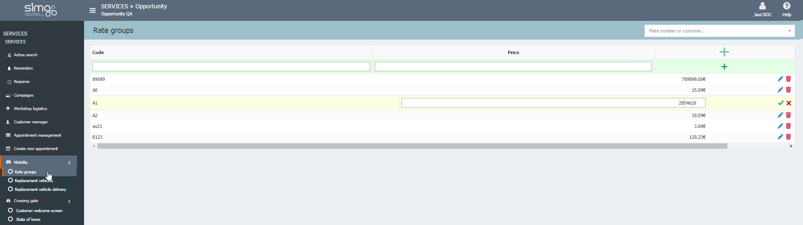
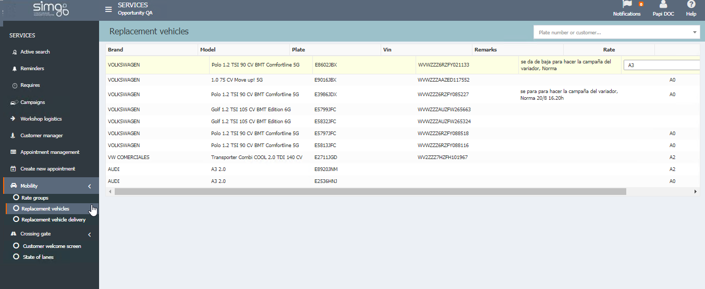
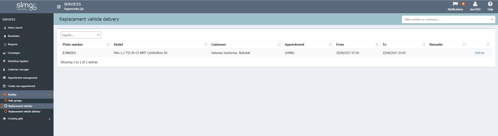
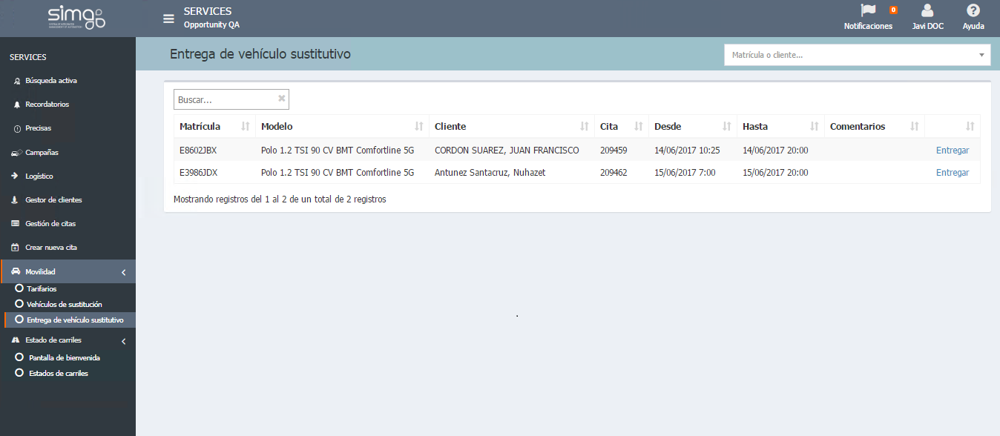

  
  
---    
  
## Mobility    
  
**Mobility** shows the options to manage the replacement vehicles we can offer to our customer during the appoinment creation process. 

  
## Rate groups  
   
**Rate groups** lets us create and assign a group and a rate to our available replacement vehicles.  

    
  

  
## Replacement vehicles  
  
**Replacement vehicles** let us check the available replacement vehicles and create or modifiy the rate group for each vehicle.
 

    
  
  
## Deliver replacement vehicles  
  
**Deliver replacement vehicles** visualizes the reservation of replacement vehicles offered to our customer during the appointment creation so that we can confirm the deliver.

  
  
When a **replacement vehicle is delivered**, the customer signed the contract digitally. A PDF is created and sent to the customer via mail. This PDF is stored in the workshop order.

  

 Contractual clauses showed to the customer, are the same that are included in the document. To configure them the user should configure the new layout report related with the clauses. Also it is possible to define the mail layout which the customer will receive.
 
