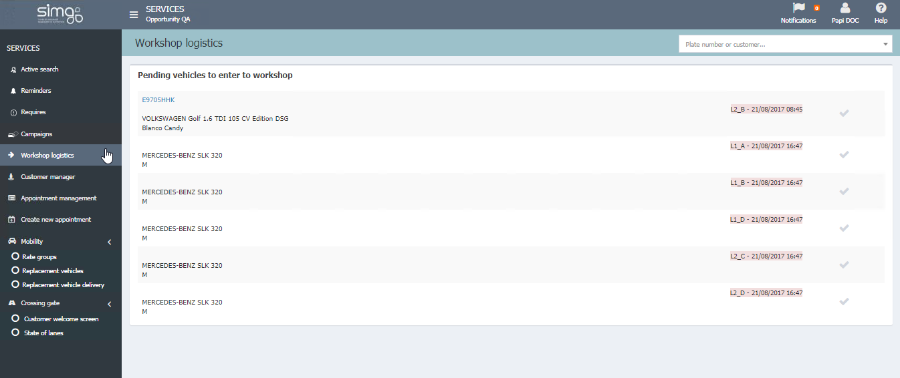

  
  
---   
  
**WORKSHOP LOGISTIS** 

**Workshop logistics** manages those vehicles that have been _already received_ and that are waiting to enter our workshop.   Shows information about vehicles already received, location and reception date and time.
  

  
To _retire_ a vehicle we will clic on **Workshop logistics** and then  , at this moment the location in the lane is empty.
  

  
