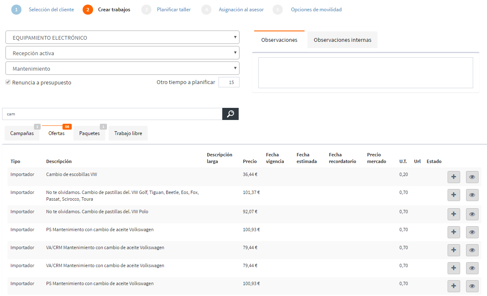

  
  
---  

# Búsqueda activa

**Búsqueda activa** es accesible desde el menú de opciones, y gestiona las _fichas de cliente_  que se estiman con mayores probabilidades de éxito para la venta de servicios.  Para comenzar a trabajar seleccionaremos un _Servicio de Mantenimiento_.      

  

Cada **Ficha de cliente** contiene la siguiente información:  
  
 > - **Depositario** y **Propietario** del vehículo.  
 > - **Datos del Vehículo**: _Campañas_, ofertas de _PPSO_ y _Active Selling_, y _Mantenimientos_.  
 > - **Argumentos de venta**: consultar información de los _Registros_, _Garantías_, _Contratos_, estado de las _Campañas_:  
 >> - **No realizada**: pendiente de aplicar.  
 >> - **Planificada**: ya añadida a la cita (la avería no está anulada).    
 >> - **En realización**: incluída en una orden abierta (avería no anulada).    
 > - **Ofertas del fabricante**.  
 > - **Precisas** detectados en el taller.
 > - **Comunicaciones** registradas con el cliente.

Y podremos realizar las siguientes acciones:     
  
 >- Dejar feedback del cliente: _Clic sobre el número de teléfono_.     
 > -  consultar y modificar comentarios internos (urgentes o no) relacionados con el cliente .   
 > -  Consultar el resumen de taller del vehículo.  
 > -  Crear cita para el cliente.  
 

 Se indicará que el cliente no quiere ser contactado con el icono .   
      

## Histórico de reparaciones     

**Histórico de reparaciones** visualiza las citas planificadas para el vehículo y las reparaciones que se le han realizado, además de las correspondiente posiciones de cada trabajo.  
  

   
## Crear cita 

**Crear cita** inicia el proceso de crear uan nueva cita  desde la _Ficha de cliente_  en el icono .  Al mismo tiempo, tenemos siempre visible el _Resumen de cita_, a la derecha. 
  
Además, podemos realizar las siguientes acciones:     
  
 > -   Acceder al histórico de reparaciones .   
 > -   Modificar los datos de contacto con el cliente .      
 > - Editar los kilómetro estimados.
 > - Seleccionar el teléfono del cliente para la cita.  
 > - Eliminar trabajos de la orden.
 > -  Indicar si el _cliente esperará en sala_ o si acepta _Recepción activa_.       
 > - Añadir _Observaciones internas_ y _Observaciones_ generales al trabajo.
  
  

 No podrás crear una cita si tu usuario no tiene los permisos necesarios.
  

### Proceso de creación de la cita     
  

**1. Seleccionar taller y cliente** 

    
Elegiremos taller en **Seleccionar un taller** y después cliente  (propietario, depositario).  En caso de no encontrarlo, podemos crear un nuevo cliente en _No es ninguno_.  
      

     
  

**2. Crear avería**  
  
Seleccionaremos un _Servicio disponible_ y los _Paquetes_, _Ofertas_ y _Campañas_ aplicables a nuestro vehículo, definidos previamente  por el concesionario para sus marcas.     
  
    
  
Los _Paquetes_, las _Ofertas_  (PPSO y Active Seling) y las _averías libres_ deben añadirse individualmente.     
 
También podremos crear _averías libres_.       

En **Mostrar detalles opcionales** indicaremos lo siguiente:   
  
 >- _Origen_ y _Tipo_ de la avería.  
 >- _Otro tiempo a planificar_ para la avería seleccionada.
 >- El cliente _Renuncia a presupuesto_ o no.   
  
 
  
Los trabajos se añadirán tengan o no _posiciones de trabajo_. Éstas podrán visualizarse haciendo clic en 

  
  
 

**3. Planificar el taller**    

Ahora seleccionaremos _individualmente_ cada avería/trabajo, y las asignaremos, también _individualmente_ a un taller, según disponibilidad.  

   
  
Si quieremos _modificar la planificación_, seleccionaremos el trabajo concreto y otro equipo/planificación.    

 Si eliminamos un trabajo desde la ficha de la cita, tendremos que crearlo desde el paso 2.
  

**4. Asignar asesor**  
  
Seleccionaremos **Fecha**, **Hora** y **Asesor** o priorizaremos por _Asesor_ en el menú contiguo.         

      
   
**5. Opciones de movilidad**  
  
**Opciones de movilidad** nos permite indicar si el cliente desea un _Vehículo sustitutivo_, _Taxi_ o si _No solicita movilidad_ durante el tiempo de su vehículo en el taller.  
  
**Finalizar** creará la cita en el taller y cerrará el proceso.   

 

> Desde el resumen de la cita, podremos indicar si el cliente **Espera en el mostrador** o acepta _Recepción activa_.  
  
---  
  
## Ficha cliente  
 

**Ficha cliente** muestra la información de contacto y domicilios del cliente haciendo clic en , situado en el resumen derecho. 
  
     
  
Aquí podemos realizar las siguientes acciones:
  
 > - Editar información de medios de contacto.
> > - Teléfono, móvil y correo.
> > - Anotar observaciones relacionadas con ellos.   
> > - Indicar hora de contacto preferida por el cliente.  
> > - Indicar el medio de contacto preferido por el cliente.  

> - Consultar los domicilios del cliente.

  
  
  
## Feedback del cliente

**Feedback** nos permite recoger la respuesta del cliente durante nuestra llamada. Accederemos haciendo clic en el _número de teléfono_ 

     

Cada feedback recogido _afecta al sistema_ de manera distinta:  
 

 > - Mantenimiento aceptado - **La oportunidad aparece de nuevo** para el próximo mantenimiento.  
 > - Recordar el _DD/MM/AA_ a las _HH/MM_ - **Se crea una recordatorio de Cita**.  Los recordatorios abiertos irán desapareciendo de la lista.  
 > - Volver a contactar - **La oportunidad aparece de nuevo** al reiniciar la aplicación.   
 > - No quiere mantenimiento (seleccionar motivo de rechazo) -**La oportunidad no aparece más** para el mantenimiento concreto. 
 > - No contesta - **La oportunidad aparece de nuevo** a los 5 días.   
  

También podemos dejar _Observaciones_ y anotar los _Kilómetros actuales_ que nos diera el cliente. Esto nos recalculará las fechas estimadas de los planes de mantenimiento.  
  

La ventana de  **Feedback** nos permite indicar el interés del cliente por otros mantenimientos. Esta información actualizará el apartado de **Comunicaciones** de la ficha de cliente.      
  
  
### Feedback para mantenimientos ya planificados

**SIMA Service** nos permite visualizar la fecha para la cual un mantenimiento ya ha sido previamente planificado.  

  

Si existe una _planificación sobreel mantenimiento_, se mostrará el mensaje **Planificado** al pasar el ratón sobre el mantenimiento concreto.

  

  

