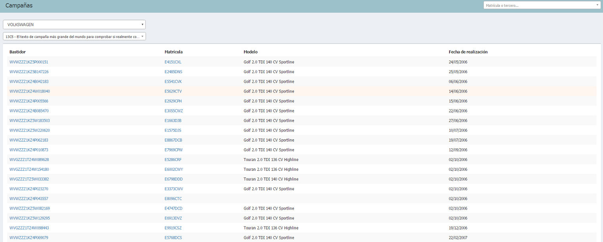

  
  
---    
  
**CAMAPAÑAS**
  

**Campañas** nos muestra el listado de todos los vehículos (bastidores) sujetos a la campaña que hayamos seleccionado.  Para visualizar los vehículos debemos:  
  
 >**1.** Seleccionar marca.  
 >**2.** Seleccionar/Buscar una campaña.

    
 
  
  
## Actualización de campañas  

**Actualización de campañas** no se ve afectada por el feedback del cliente de manera que la _Ficha del cliente_ solamente desaparecerá del listado cuando se de una de las siguientes situaciones:  

 - La campañas ya está realizada.    
 - El cliente tiene cita para realizarla.  
  

