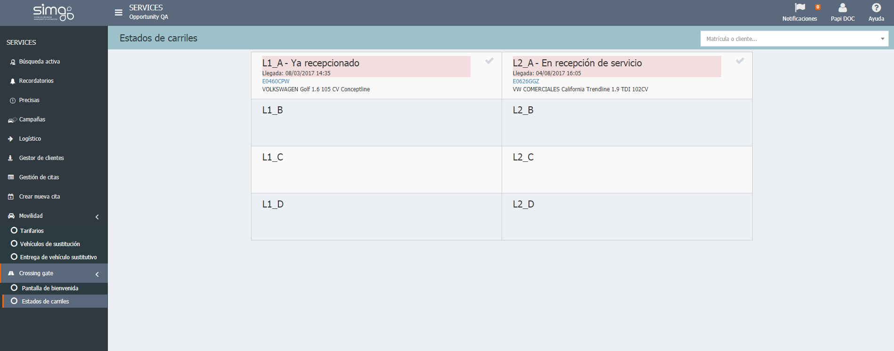

  
  
---     
  
**CROSSING GATE**  
  
**Crossing Gate** nos permite consultar el estado de los carriles en el taller.  
  

  
  
Además, podemos  **cambiar el estado de la recepción** del vehículo y visualizar la siguiente información:  
  
 - **Nº de carril**.  
 - **Estado del vehículo**: _Ya recepcionado_, _En recepción_, etc.    
 - **Datos de la cita**.  
 - Datos del vehículo: matrícula y marca. 

