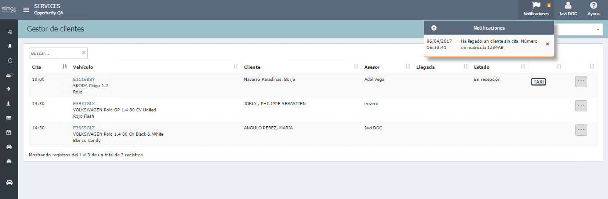

  
  
---    
  
## Gestor de clientes

**Gestor de clientes** nos muestra todos los vehículos que tienen cita hoy en el taller y hacer seguimiento de los clientes en la sala de espera. 
  
  
  
**Gestor de clientes** nos permite indicar si un cliente _Ha llegado_, y ver la siguiente información:

  
 - Cliente llegó al taller y a qué hora.   
 - Si el vehículo se encuentra ya En recepción.
 -   Vehículo ha llegado.  
 -  Información vehículo sustitutivo.  
 -  Cliente solicitó taxi. 
 -  Cliente aceptó recepción activa.        
 
 También podemos indicar si el cliente _No ha llegado_.    
   
## Vehículo sustitutivo  
  
**Vehículo sustitutivo** nos permite ver la reserva y entregar el vehículo a nuestro cliente. Para más información ver apartado de la ayuda  *Entrega vehículo sustitutivo*.
 

  

  

 
