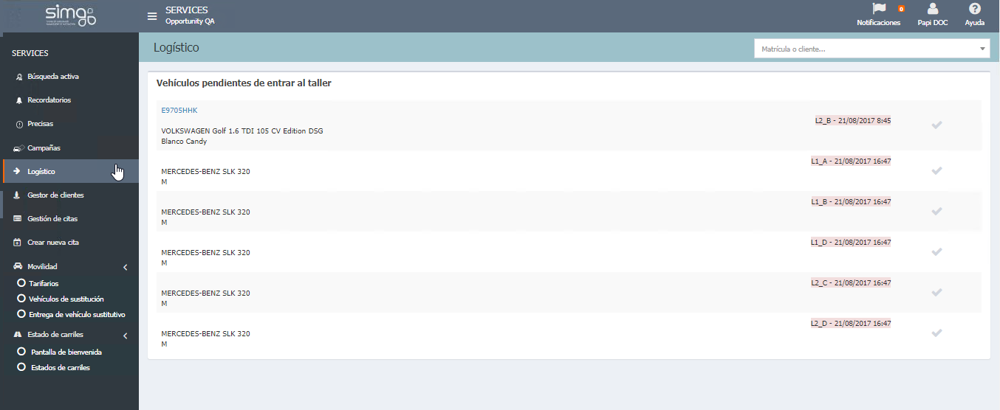

  
  
---   
  
**LOGÍSTICO** 

**Lógistico** nos permite gestionar la entrada de los _vehículos ya recepcionados_ para retirarlos de los carriles o del parking de clientes.  Muestra información sobre el vehículo ya recepcionado por los asesores, la posición en la que se encuentra y la fecha y hora de recepción.
  

 
  
Daremos entrada a los vehículos accediendo a la opción **Logístico** y pulsando  , en ese momento los vehículos que se pueden encontrar en los carriles son retirados dejando el hueco libre. 
  

 
  
