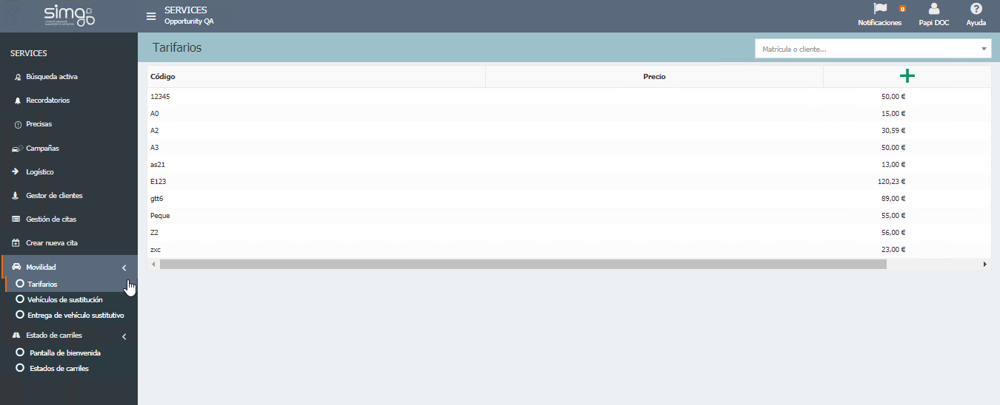
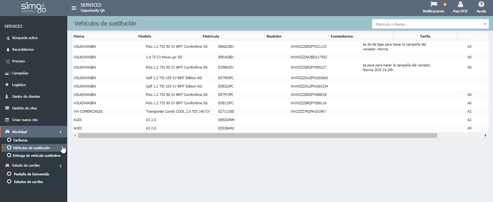
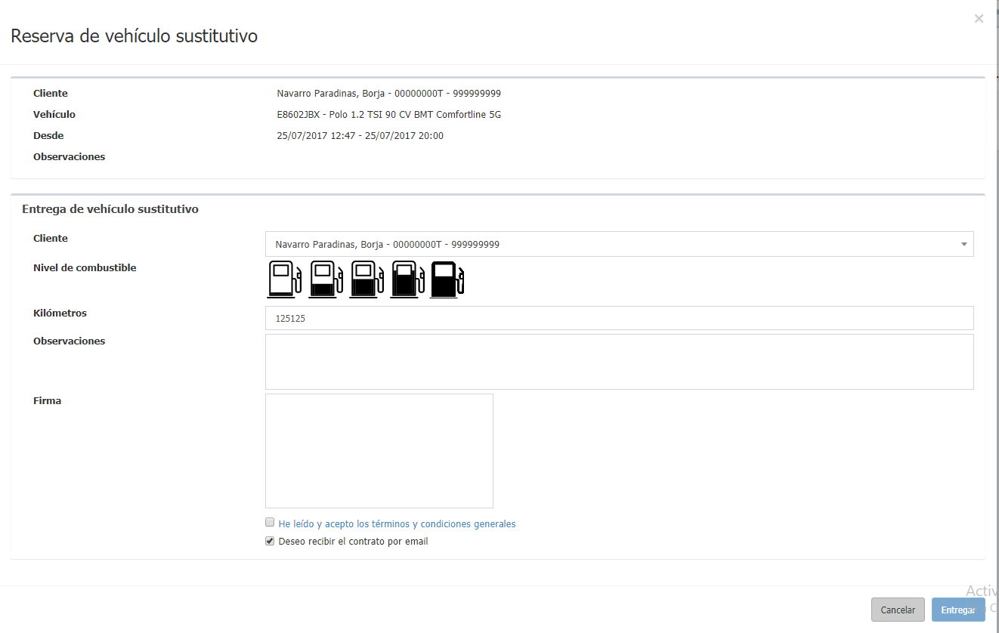

  
  
---      
  
## Movilidad  
  
**Movilidad** gestiona los vehículos sustitutivos que ofreceremos al cliente durante la creación de la cita. 
  

  
## Tarifario 
   
**Tarfiario** nos permite crear y asginar _Grupo_ y _Tarifa_ a nuestros vehículos sustitutivos disponibles.  
  

    
  

  
## Vehículos sustitutivos  
  
**Vehículos sustitutivos** nos permite consultar los vehículos sustitutivos disponibles así como modificar el grupo y tarifa asignados a cada uno de ellos.  
 

    

  
Actualmente podemos _Editar_ el **código** de nuestros vehículos de sustitución disponibles.  
  
## Entrega de vehículo sustitutivo  
  
**Entrega de vehículos sutitutivos** visualiza las reservas pendientes de entregar de vehículos sustitutivos solicitados ofrecidos al cliente durante la cita para confirmar su entrega.   

  

Cuando se **entrega un vehículo sustitutivo**, el cliente confirma el contrato firmando digitalmente,  generándose un documento PDF que se envía al cliente por correo y se almacena adjunto a la orden de taller correspondiente.   

  

 Las claúsulas contractuales que se muestran al cliente y las que se incluyen en el documento, deben ser las mismas, para ello se debe usar el nuevo layout personalizable por el usuario. También es posible determinar el formato del correo que recibirá el cliente. 
