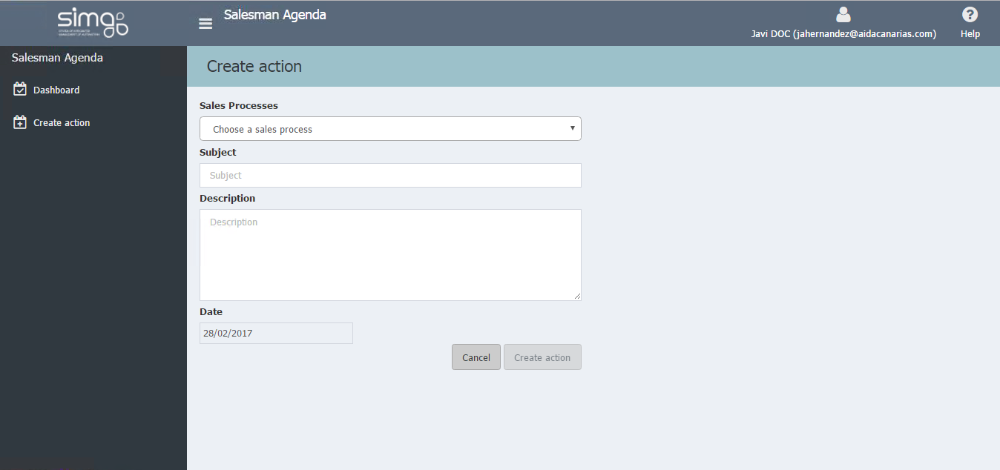

       
  
---    
  
## Create action  
  
**Create action** links a follow-up action to a previously created offer.  This feature is available from the _Dashboard_, the _Mene_ and the _Follow-up offer page_.    
  
   
  
 Papyrus will show an error if you do not document in English too.
  
Once in the page of creating an action, we will fullfil the form sections.    
  

 Actions will appear as _Pending_, for _Today_ depending on the date we have set. 
