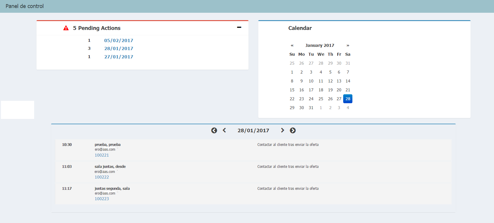
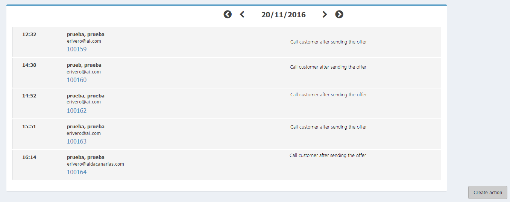
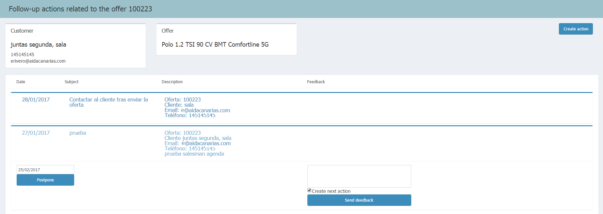

       
  
---  
  

  
## Offer follow-up
  
The **Offer follow-up** starts when we _select a date_ and _an offer_ to work with  
  
    
  
Dates can be selected from the sections of _Pending actions_, _Today_ and our _salesman calendar_.    
  
 And we copy & paste it to be translated into English. Papyrus won't let you create or save any page without having it translated.  
  

  
### Actions of an offer  
  
Después de _seleccionar fecha_, se nos mostrarán las _acciones de seguimiento_ creadas.  
  

  
  
Tras _seleccionar la oferta_, se abrirá la página de **Seguimiento de acciones de la oferta**.  
  
Aquí podremos realizar las siguientes acciones:  
  
  - Posponer la fecha de la acción de seguimiento.  
 - Guardar y enviar feedback del cliente sobre la acción.  
 - Crear acción de seguimiento.  

  

  
  

  
