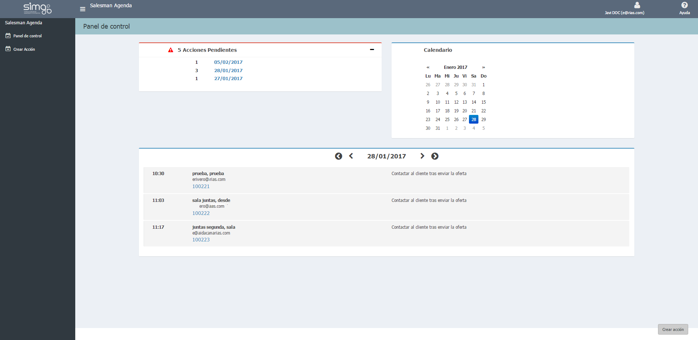

       
  
---  
  
## Salesman Agenda  
  
  
**Salesman Agenda** nos permite gestionar las _acciones vinculadas a ofertas_ creadas desde First Contact. Se organiza en un _Panel de control_ y un _Menú de opciones_.
  

     
  
Añadiremos el cambio, incluyendo imágenes. Por ejemplo:  
  

 
  

   
    
## Panel de control 
  
En el **Panel de control** podemos realizar las siguientes acciones:    
  
> **1. Seguimiento de la oferta** desde:  
>> - _Acciones pendientes_.  
>> - _Calendario de vendedor_.  
>> - _Acciones programadas_ para hoy: avanzaremos de dia haciendo clic en    
  
>**2. Crear acción**.   
  
  
  
    
  
.
  

