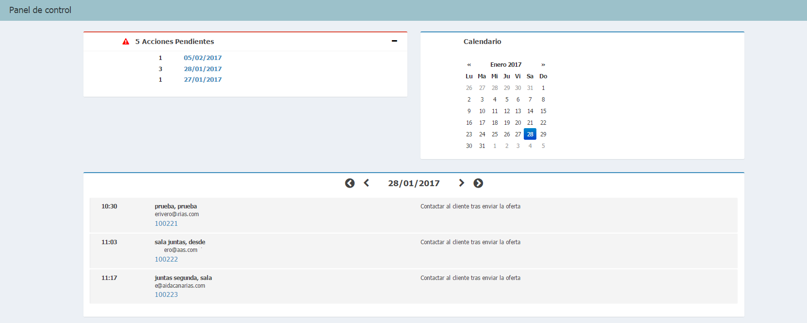
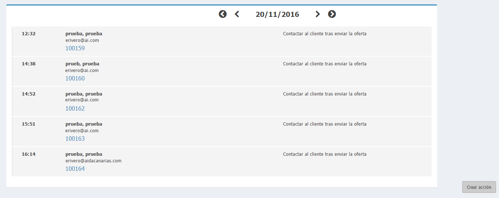
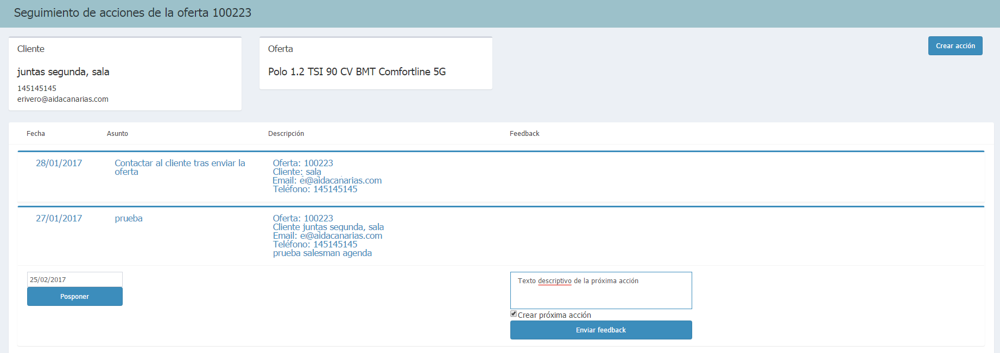

       
  
---  
  
## Seguimiento de la oferta
  
El **Seguimiento de la oferta** comienza cuando _seleccionamos una fecha_ y la _oferta_ con la queremos trabajar. 
  
    
  
Podemos elegir fecha desde las secciones de _Acciones pendientes_, _Acciones para hoy_ y nuestro _calendario de vendedor_.     
  
 Añadimos la novedad dentro de la págian o topic de un producto.   
  

  
### Acciones de la oferta  
  
Después de _seleccionar fecha_, se nos mostrarán las _acciones de seguimiento_ creadas.  
  

  
  
Tras _seleccionar la oferta_, se abrirá la página de **Seguimiento de acciones de la oferta**.  
  
Aquí podremos realizar las siguientes acciones:  
  
  - Posponer la fecha de la acción de seguimiento.  
 - Guardar y enviar feedback del cliente sobre la acción.  
 - Crear acción de seguimiento.  

  

  
  

  
  

  
