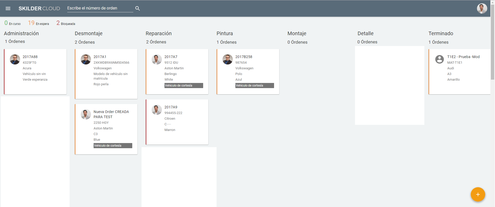
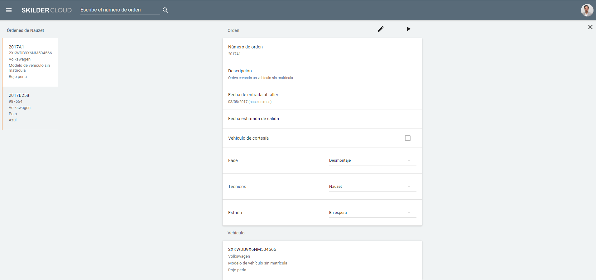

    
  
# Gestión de órdenes  
  
El rol de **manager** nos permite acceder al panel de órdenes y comenzar a **gestionar las órdenes**.  
  
    
  
Para **gestionar las órdenes** podemos:   
  
 - Buscar por número de orden.  
 - Moverlas de una fase a otra (clic y arrastrar).  
 - Acceder al detalle de la orden (clic sobre la orden):    
 > - Conocer las órdenes del mecánico.  
 > - Consultar las órdenes del mecánico.  
 > - Editar la orden.    
- Crear órdenes nuevas   
  
## Detalle de la orden    
  
Accedemos al **detalle de la orden** asignada a un mecánico haciendo _clic_ sobre ésta en el panel de gestión.   
  

  
  
Dentro del detalle de la orden, podemos:  
  
 - Consultar la información de la _Orden_ y del _Vehículo_.    
 - Consultar todas las órdenes asignadas al mecánico.
 - 

Editar la información de la orden.     
> - Actualizar la _Fase_ de la orden.  
< - Asignar un _Técnico_  diferente al a orden.  
< - Cambiar el _Estado_  de la orden. 
> - Asignar vehículo de cortesía. 
 - 
 Activar/Desactivar el contador de tiempo de piques.  
> - Modificar los datos de la orden al imputar el tiempo.  
 - 
 Cerrar la orden.

  

  
Tambié
 
  

