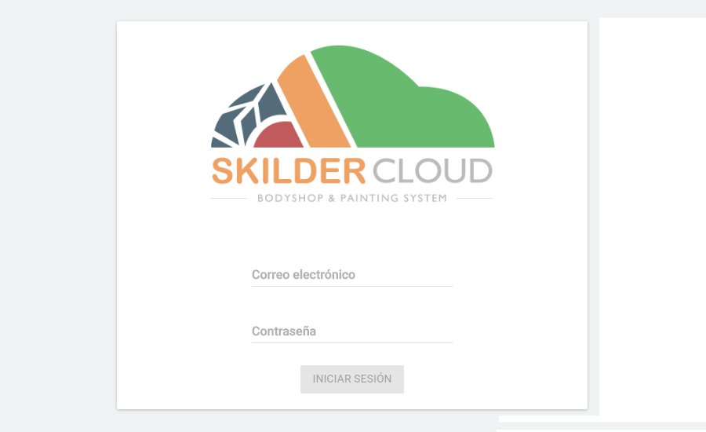
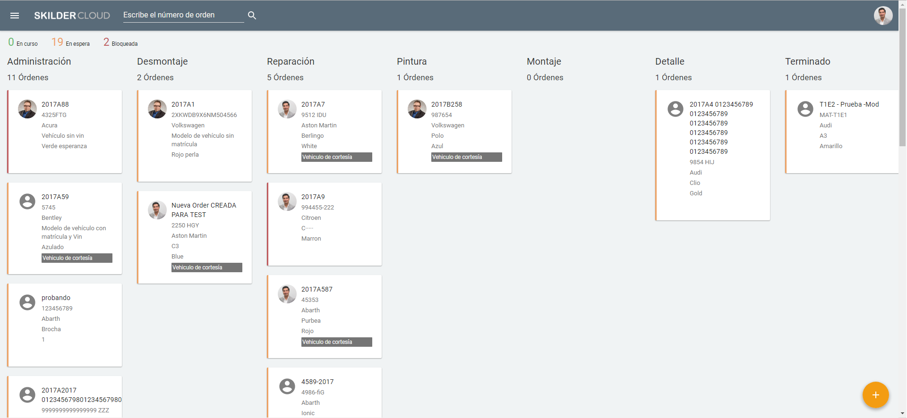
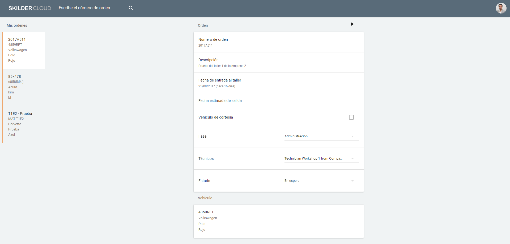

  
  
---  
  
# SkilderCloud    
  
**SkilderCloud** es la aplicación de _gestión de órdenes_ de taller a través de las fases definidas para éstas, y los roles de _Mecánico_ y _Managers_.   
  

  
  
## Roles de usuario SkilderCloud
  
**MANAGER    
  
Desde este rol podremos acceder al **estado actual** del taller, con todas las **órdenes** y la **fase** correspondiente.    

    
  
En todo momento, podremos conocer el número **total de órdenes** _En curso_, _En epera_ y _Bloqueadas_ . Además, para cada fase se nos informa sobre el **total de órdenes** en esa fase.  
  
Las **órdenes** nos muestran el mecánico asigando, el _Número de orden_, la _matrícula_ y el _mnodelo_ del vehículo además del _Color_.    
  

 Este icono nos permitirá, como _Manager_ acceder al tablero del taller (estado actual), en cualquier momento_ y a los informes.

  
**MECÁNICO      
  
Aquí se mostrará  todas las **órdenes asignadas** a nuestro mecánico así como el **detalle de la orden** seleccionada.
  

    
  
**Piques de tiempo** 
  
Podremos iniciar y detener nuestro pique de tiempo en los siguientes iconos:    
  
 >   
 > 
